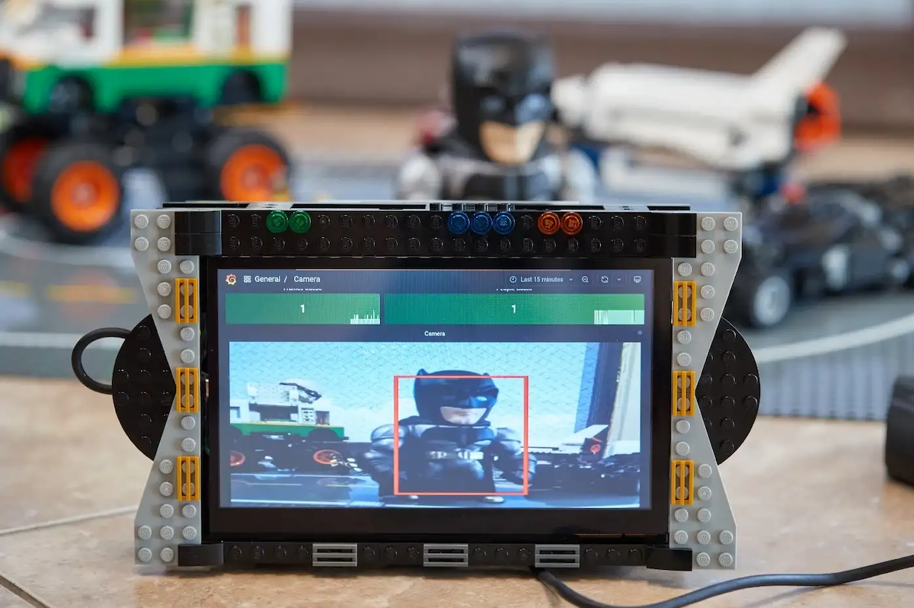

# Display Base64 encoded images from any data source on your Grafana dashboard

Base64 Image/PDF custom panel plugin was recently upgraded in the Grafana Catalog and had everything you need to display images from any data source on your dashboards.

<!--truncate-->

The initial version of the Base64 Image/PDF panel for Grafana was created for the project "Analyzing camera feed in real-time" and helped to streamline the original project by displaying AI-analyzed images on the Grafana dashboard.



Since the original version, the custom panel was upgraded to support Grafana 8, downloaded more than 45,000 times, featured in the Grafana Community Plugin Showcase (August 2021), and used for various projects like security camera monitoring.

The video version of this article is available on our [YouTube channel](https://youtube.com/@volkovlabs).

<iframe width="100%" height="500" src="https://www.youtube.com/embed/1_bgLSehjhg" title="Base64 Image/PDF panel" frameBorder="0" allow="accelerometer; autoplay; clipboard-write; encrypted-media; gyroscope; picture-in-picture" allowFullScreen></iframe>

## Getting Started

You can use the `grafana-cli` tool to install from the command line for standalone Grafana or directly in the Grafana Cloud:

```sh
grafana-cli plugins install volkovlabs-image-panel
```

In the latest version of Grafana 8.1 standalone plugin can also be installed using the Grafana Catalog application:


## Panel Features

The values returned from the data source can be Base64 encoded with or without definition in the format `data:image/jpg;base64,ENCODED-CONTENT` or `data:application/pdf;base64,ENCODED-CONTENT`. If the definition is not provided, the file type is determined automatically based on the first Base64 symbol.


If the data source returns more than one field with `string` type, you can select the Field Name in the panel's display options, and if the data source returns multiple rows, the panel will display the image from the last row.

The height and width of the image can be auto-adjusted to the panel's size, kept original, or customized based on the field's value, or panel options.