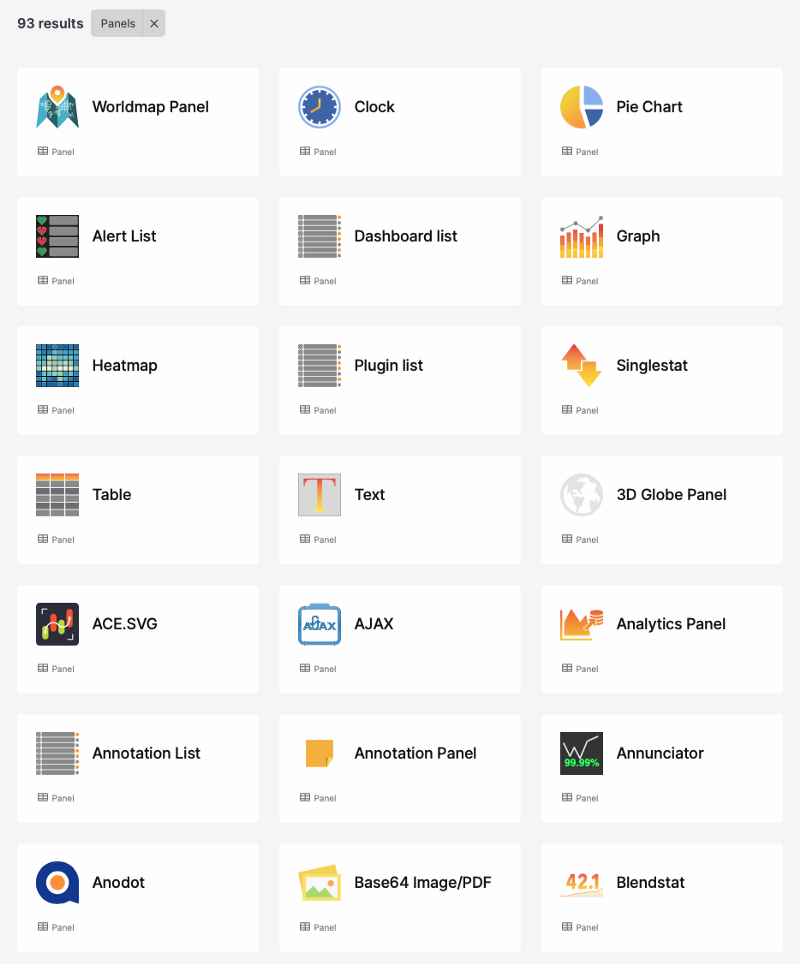
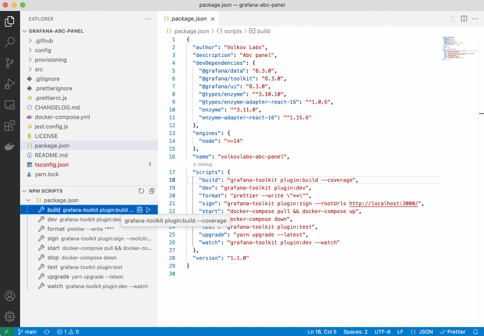
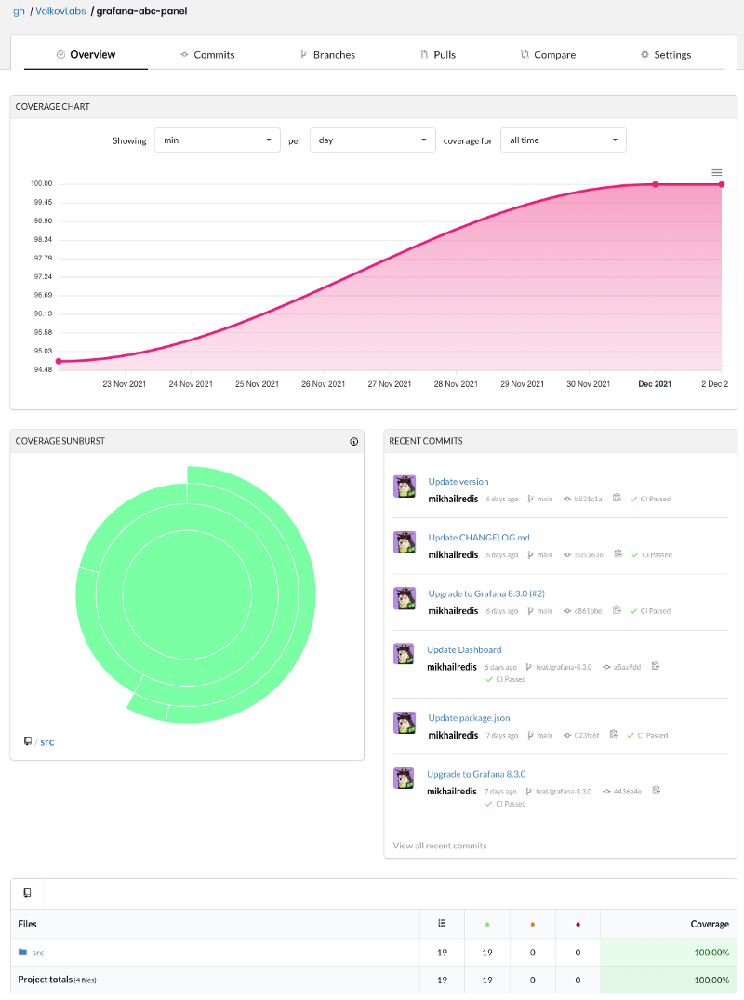

# Our own panel plugin template for Grafana

Grafana has excellent tutorials on building panel plugins, but we found ourselves repeating the same steps when creating custom plugins for our customers.

<!--truncate-->

Eventually, we decided to create our own template for a panel plugin, which I hope can be helpful for the community.

Grafana's tutorial [Build a panel plugin](https://grafana.com/tutorials/build-a-panel-plugin/) provides information on setting up the environment, creating a new plugin, and explaining the basics of a panel development using data frames and options control. It's a great starting point, and we recommend reading it before continuing with this article!

As I mentioned before, we wanted to have a template, which can be used as a base for a new panel with everything in place and updated to the latest version of Grafana. We called it the [ABC panel](https://github.com/VolkovLabs/volkovlabs-abc-panel).

## What is the panel plugin, and why do you need one

Panels allow visualizing of data received from data sources. While Grafana has several built-in panels like Table, Time Series, and Text, you can also create your own custom panels.



There are a lot of use cases that require custom visualization with additional logic implemented on the front end, which goes beyond standard panels. 

## Docker containers benefits

For all of our developments, we use Docker and Docker Compose. [Compose](https://docs.docker.com/compose/) is a tool for defining and running multi-container Docker applications.

Here are some benefits of using Docker containers compared to locally installed Grafana:

- Easy to deploy and share configuration with team members and customers.
- Allows testing plugins against multiple versions and the main branch to be prepared for the upcoming release.
- Docker always starts from a fresh configuration with initial Provisioning done automatically (more information below).

Our typical configuration for Grafana is included in the template:

```yaml
services:
  grafana:
    container_name: grafana
    image: grafana/grafana:latest
    ports:
      - 3000:3000/tcp
    environment:
      - GF_AUTH_ANONYMOUS_ORG_ROLE=Admin
      - GF_AUTH_ANONYMOUS_ENABLED=true
      - GF_AUTH_BASIC_ENABLED=false
      - GF_ENABLE_GZIP=true
      - GF_USERS_DEFAULT_THEME=light
      - GF_INSTALL_PLUGINS=marcusolsson-static-datasource
    volumes:
      - ./dist:/var/lib/grafana/plugins/abc-panel
      - ./provisioning:/etc/grafana/provisioning
```

In this configuration, Grafana starts in Anonymous mode and does not require authentication. Any plugins can be installed at the start-up automatically. We use the Static Data Source to prototype the idea and then add additional services to Docker Compose and corresponding data sources to Grafana.

## Building and Signing

Before starting the Grafana container, the plugin should be built and signed in the `/dist` folder. This folder is exposed to the Grafana container in the provided configuration. Plugin signing was introduced in Grafana 7.0 and became mandatory for Grafana 8.0. Take a look at the [Documentation](https://grafana.com/docs/grafana/latest/developers/plugins/sign-a-plugin/) to learn more about different signing levels.

While developing to build and sign plugins as `Private` we use scripts configured in the `package.json` file. When the plugin is ready to release, the signature can be updated by the Grafana team to `Community` or `Commercial` and parameter `rootUrls` can be removed:

```json
"scripts": {
    "build": "grafana-toolkit plugin:build --coverage",
    "sign": "grafana-toolkit plugin:sign --rootUrls http://localhost:3000/",
  },
```

Scripts can be executed using command-line or Visual Studio Code, which is our preferred UI for development, and we recommend it to our clients who want to contribute and follow the process:



You may notice special `--coverage` flag added to the build command to generate coverage files, which are uploaded and reviewed as a part of Continuous Integration (CI).

## Initial Provisioning

To make the development process repeatable, transferrable, and easier for the Grafana team to Review, we create provisioning files to add data sources, application plugins, and dashboards in the `/provisioning` folder.

Here is an example of how to add a Static Data Source:

```yaml
datasources:
  - name: Static
    type: marcusolsson-static-datasource
    access: proxy
    isDefault: true
    orgId: 1
    version: 1
    editable: true
```

To add or update dashboards, they should be exported as Global and placed in the `/provisioning/dashboards` folder. Detailed information can be found in the Grafana [Documentation](https://grafana.com/docs/grafana/latest/administration/provisioning/).

## Testing and Continuous Integration

Validating tests coverage is included in the CI workflow. To track coverage, we use CodeCov - the leading Code Coverage solution.



On every commit, GitHub CI Action checks the plugin's functionality by running tests and submitting coverage to CodeCov. With additional functionality, overall test coverage can decrease, and the action fails. The CodeCov can track it and help you keep the test coverage on an acceptable level.

Here is a part of the GitHub Action to submit coverage to CodeCov:

```yaml
- name: Upload coverage to Codecov
        uses: codecov/codecov-action@v2
        with:
          directory: ./coverage/
          files: ./coverage/lcov.info
          env_vars: OS,PYTHON
          fail_ci_if_error: true
```

## Long-term Support

Every release of Grafana introduces new features, breaking changes, and minor updates. Depending on the features and complexity of the custom plugin, some tests can fail, and parts of the code should be replaced or improved with every major Grafana release.

We recommend doing manual testing of custom plugins and applications for each new release. As mentioned before, Docker with Provisioning included in the template makes it easy.
