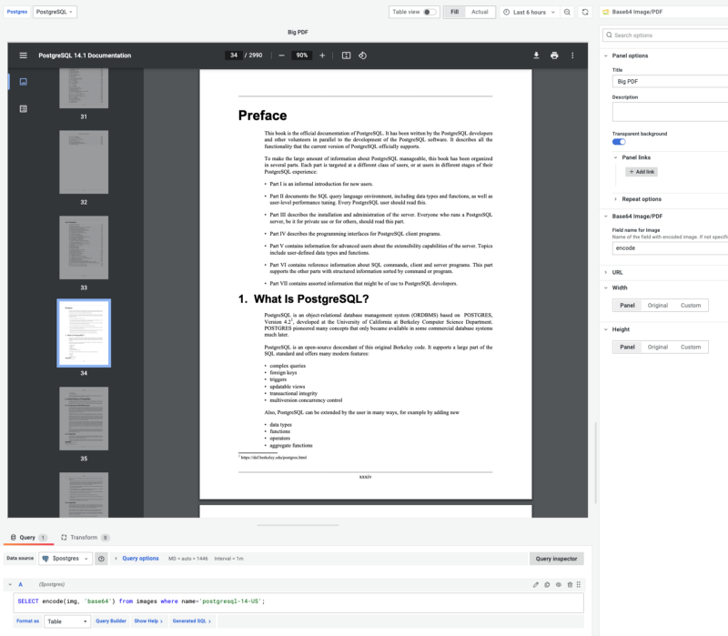

# Using Grafana to display Large PDF documents? We've got you covered

We discussed the benefits of using Docker containers and initial Provisioning in [the recent article](/blog/display-base64-encoded-images-from-any-data-source-on-your-dashboard-398a99ba5b5e) on creating our panel plugin template for Grafana. While working on the current feature request for the Base64 image/PDF panel, this technique helped us quickly deliver solutions and improve the long-term support for the panel.

<!--truncate-->

When we created a Base64 image/PDF panel to display images for one of our projects, support for PDF documents was added as a feature. I am glad the panel is being used to display PDF documents stored in the databases like PostgreSQL.

You can learn more about the plugin in the video on our YouTube channel.

<iframe width="100%" height="500" src="https://www.youtube.com/embed/1_bgLSehjhg" title="Base64 Image/PDF panel" frameBorder="0" allow="accelerometer; autoplay; clipboard-write; encrypted-media; gyroscope; picture-in-picture" allowFullScreen></iframe>

Depending on the size, PDF documents are classified as
- Small (10–100kb)
- Medium (100–1MB)
- Large (1–16 MB)
- Huge (16–128 MB).

Our panel supported Small and Medium-sized PDF documents, which are easy to test and do not require any database to store. We used the [Static Data Source](/plugins/volkovlabs-static-datasource), and data was held in the dashboard.

To test support for Large documents, we had to install PostgreSQL, load PDF documents into the database, create a data source and dashboard to validate and check performance. Also, it has to be scripted, easy to deploy for continuous integration and development.

## Adding Docker container for PostgreSQL and loading PDF documents

From Grafana's point of view, all data sources are the same while they return data frames. The panel's feature request was opened to support Large PDF documents retrieved from PostgreSQL, and this is why we experimented with it instead of our favorite Redis.

To install PostgreSQL, we added a container with the latest version of the image `postgres`. We specified a volume for the folder `/docker-entrypoint-initdb.d`, which takes care of creating necessary tables and permissions when starting.

```yaml
postgres:
  image: postgres
  restart: always
  environment:
    POSTGRES_PASSWORD: postgres
  ports:
    - 5432:5432
  volumes:
    - ./postgres:/docker-entrypoint-initdb.d
```

In our case, it was a table with `bytea` fields to store binary data with unique names. Images and PDF documents can be stored in base64 format or converted using the command `encode()` when retrieved from the database.

```sql
CREATE TABLE images (name text, img bytea, UNIQUE(name));
```

To load PDF documents and a test image into the database, we created a Node.js script:

```js
const fs = require('fs');
const { Client } = require('pg');
async function loadFile() {

/**
* Connect to Postgres
*/
const client = new Client({ user: 'postgres', password: 'postgres' });
await client.connect();

/**
* Load PDF to Postgres
*/
const pdfData = fs.readFileSync('./postgresql-14-US.pdf');
await client.query('INSERT INTO images VALUES($1, $2)', ['postgresql-14-US', pdfData]);

/**
* Load Image to Postgres
*/
const imgData = fs.readFileSync('../src/img/image-panel.png');
await client.query('INSERT INTO images VALUES($1, $2)', ['image-panel', imgData]);

/**
* Check number of records
*/
const res = await client.query('Select count(1) from images');
console.log('SELECT Result', res.rows);

/**
* End Session
*/
await client.end();
}
loadFile();
```

## Provisioning PostgreSQL data source and dashboard in Grafana

Our Panel plugin template already has the Initial Provisioning configuration in place to add a new dashboard for PostgreSQL.

```yaml
apiVersion: 1
providers:
  - name: Default
    type: file
    options:
      path: /etc/grafana/provisioning/dashboards
```



And we additionally added configuration to provision PostgreSQL data source with SSL disabled, specific username, password, and URL.

```yaml
apiVersion: 1
datasources:
  - name: PostgreSQL
    type: postgres
    access: proxy
    orgId: 1
    version: 1
    editable: true
    url: host.docker.internal:5432
    user: postgres
    editable: true
    jsonData:
      postgresVersion: 1200
      sslmode: disable
    secureJsonData:
      password: postgres
```

You can learn more about the PostgreSQL data source in the official [Documentation](https://grafana.com/docs/grafana/latest/datasources/postgres/).

## Load data

The last step is to start containers and load data. When starting, Grafana and PostgreSQL will be auto-provisioned and ready to go. Overall, a 13Mb PDF document with 2990 pages takes 1–2 seconds to display. The user confirmed the feature request, and the plugin was sent to the Grafana team to review and update the Grafana Catalog.

Take a look at [the repository](https://github.com/VolkovLabs/volkovlabs-image-panel) and let us know if you have any questions or future requests.
