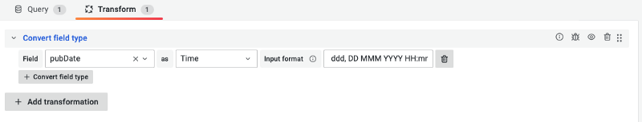
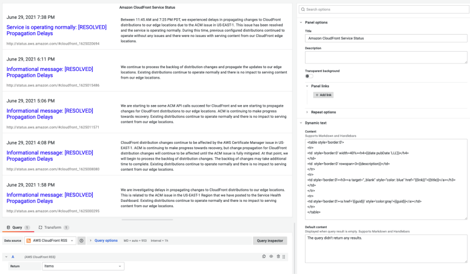
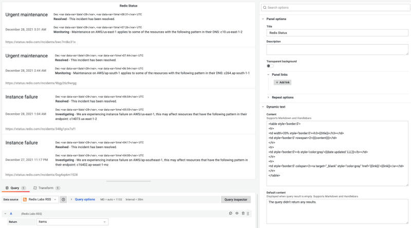

# Do you want to be on top of the latest news while staying in Grafana?

What is the first panel you see when opening Grafana? It's probably the News panel on the Home dashboard with the latest blog posts from the Grafana team and community. The News panel fetches the RSS feed directly in the browser, and while it works for some feeds, it has manifold limitations.

<!--truncate-->

Looking around, we found multiple discussions and issues opened regarding updating the News panel or creating an RSS and Atom data source. The question is, how to display data from such data sources? Timeseries or Table panels won't be the perfect candidates to demonstrate news with a custom layout.

The video version of this article is available on our YouTube channel.

<iframe width="100%" height="500" src="https://www.youtube.com/embed/RAxqS2hpWkg" title="RSS/Atom data source" frameBorder="0" allow="accelerometer; autoplay; clipboard-write; encrypted-media; gyroscope; picture-in-picture" allowFullScreen></iframe>

We maintain the [Dynamic Text panel](/plugins/volkovlabs-dynamictext-panel), which can display data frames using a custom layout based on Markdown, HTML, and Handlebars.

RSS data source was created based on the recently released [data source plugin template](/plugins/volkovlabs-abc-datasource). This template is similar to the panel plugin template introduced in the previous articles. RSS/Atom data source retrieves feed and returns data frames to display news using Dynamic Text or other custom panels.

> RSS/Atom data source was added to the Grafana Catalog on Jan, 12 2022.

## What is the data source plugin, and how to create one?

> Data source plugins communicate with external sources of data and return the data in a format that Grafana understands. By adding a data source plugin, you can immediately use the data in any of your existing dashboards.

There are 120 data source plugins available in the Grafana Catalog; 22 were added this year. When considering creating a new data source plugin, there are multiple questions you have to answer:

- Can the data be retrieved using the HTTP(S) protocol?
- Does the standard HTTP(S) backend fit your needs and provide all required authentication options?
- Does the data source require Alerting support?

RSS and Atom feed can be accessed using HTTP(S) protocol and, in most cases, do not require authentication at all. Authentication can be added in the future version, and default authentication options in the HTTP(S) backend should be sufficient.

We decided to create an RSS/Atom data source based on [our data source plugin template](/plugins/volkovlabs-abc-datasource) without a backend. This template is similar to the panel plugin template and provides Docker Compose, Initial Provisioning, Continuous Integration with test coverage configuration out of the box.

## Custom Grafana News Panel

Let's add a new RSS data source for the Grafana blog and create a panel to display the latest news similar to the News Panel. RSS/Atom data source can be added manually using the Configuration -> Data Sources menu or provisioned using configuration files.


```yaml
datasources:
  - name: Volkov Labs RSS
    type: volkovlabs-rss-datasource
    access: proxy
    isDefault: true
    orgId: 1
    version: 1
    editable: true
    jsonData:
      feed: https://volkovlabs.io/blog/rss.xml
  - name: AWS CloudFront RSS
    type: volkovlabs-rss-datasource
    access: proxy
    orgId: 1
    version: 1
    editable: true
    jsonData:
      feed: https://status.aws.amazon.com/rss/cloudfront.rss
  - name: Grafana RSS
    type: volkovlabs-rss-datasource
    access: proxy
    orgId: 1
    version: 1
    editable: true
    jsonData:
      feed: https://grafana.com/blog/news.xml
```

The next step is to add a Dynamic Text panel on the dashboard and set content with Markdown, HTML, and Handlebars.


To correctly display the date, it should have a type `Time`. All fields returned by the data source have a type `String` and can be transformed by converting field type with a specified input format to `Time` or `Number`.



Here is the panel's content to achieve a look similar to the News panel:

```html
<table cellpadding="0" cellspacing="0" border="0" style='border:0'>
  <tr style='border:0'>
    <td style='border:0'></td>
    <td style='border:0'><b>{{date pubDate 'MMM DD'}}</b><h3><a style='color:blue' target="_blank" href="{{link}}">{{title}}</a></h3>{{description}}</td>
  </tr>
</table>
```

You can read more about the Dynamic Text panel and various helpers you can use in the [Documentation](/plugins/volkovlabs-dynamictext-panel).

## What other feeds can be displayed using the RSS/Atom data source?

The goal of creating an RSS data source was to support the Medium feed for Volkov Labs, which has CORS (Cross-Origin Resource Sharing) enabled and can't be displayed using the News panel. Medium returns images and descriptions embedded in the `content:encoded` field, not supported in the News panel.

The data source takes care of extracting additional information from the `meta`, `guid `, `content:embeded`, and other fields. The final layout for the Volkov Labs newsfeed looks very similar to the Medium links you can see in this article.


When AWS has another outage, you can track the status directly on the Grafana dashboard.



The Redis Status page is based on the Atom format and can be displayed using this data source.



Using the RSS/Atom data source, you can combine your system and application metrics with newsfeeds from AWS, Redis, and other providers to be presently informed if they have any issues on their side.