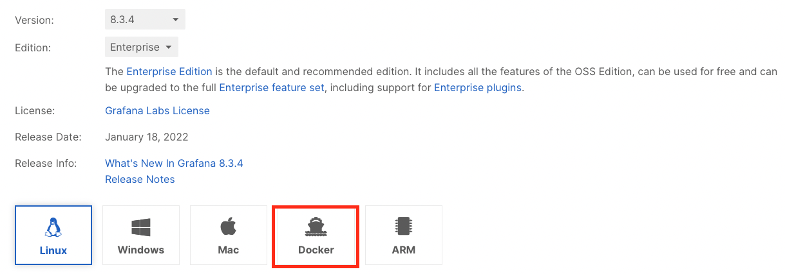
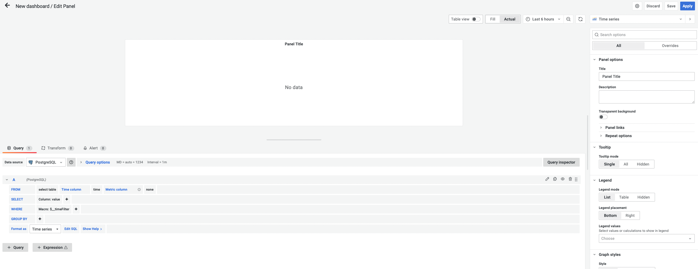
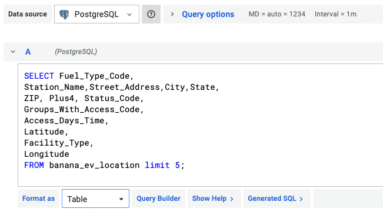
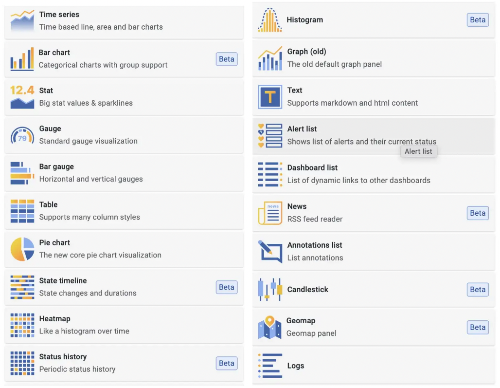
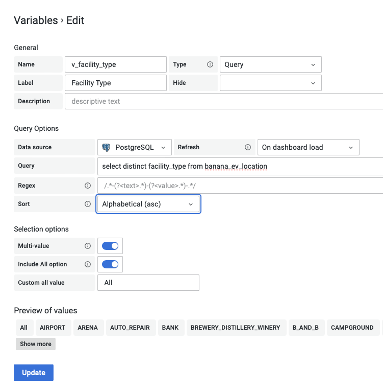
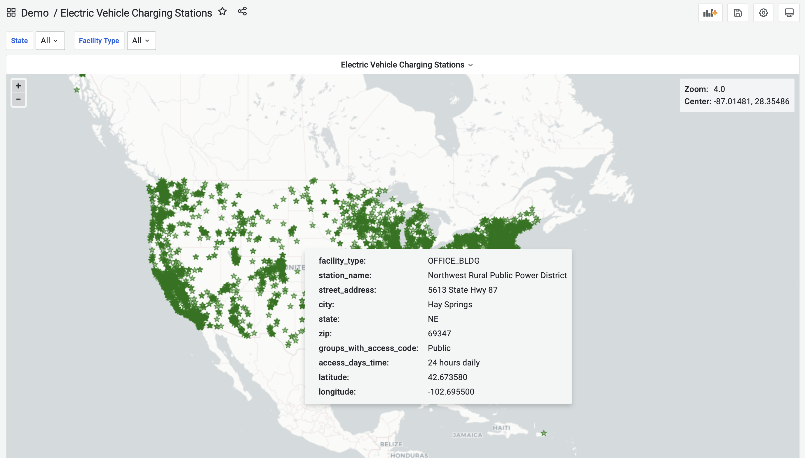

# How to create your first Grafana Dashboard

We all heard that to get a better grasp of something. It is better to see it once than to hear about it a thousand times. Could anything be better than seeing? Creating it yourself!

<!--truncate-->

The satisfying AHA moment, a.k.a. 'Now I get it' moment sparks up just after you personally iron all little wrinkles along the way.

Let's get started. After reading my article and following along, I hope you will arrive at the same results as I did. Please, feel free to ask questions. I will be thrilled to help you solve your issues as I consider myself a Grafana expert and appreciate a good challenge once in a while to prove it.

<iframe width="100%" height="500" src="https://www.youtube.com/embed/HNCKbGfAU0Q" title="How to create your Business Grafana dashboard | Step by step for analysts | Grafana Tutorial" frameBorder="0" allow="accelerometer; autoplay; clipboard-write; encrypted-media; gyroscope; picture-in-picture" allowFullScreen></iframe>

Suppose your brain works like mine and requires a high-level picture first, then before proceeding, I recommend you to take a look at [my previous article](/blog/grafana-101-what-why-who-6b25f0d0fd11). It talks about what Grafana is, what components it consists of, and how they interact. That article also lays out all key Grafana concepts.

If you can not wait any longer, let's get to it!

## Choose a dataset

Start with deciding what exactly you will display on your first Grafana Dashboard. That question ventured me to the [Kaggle.com](https://kaggle.com) website. It is the largest online community for data scientists, which also provides a ton of datasets for free download.

I was intrigued by the electric vehicle charging station locations dataset as I immediately imagined using the Geomap Grafana visualization. It takes latitude and longitude as parameters to draw data points on the world map. The dataset set has more than 50K entries and promises to look impressive on the map.


The Geomap visualization is currently in the Beta version. Should that have been a concern? Maybe for shy and hesitant, but I felt lucky that day! Adventure is my middle name, as they say.

After I downloaded and eyeballed the dataset, I realized it might have had too many columns for a quick experiment. I went ahead and removed the columns that did seem unnecessary. It does not mean that the ones I kept are all important. The absolute must are only two of them: Latitude and Longitude. The rest are up to you. The list of what I kept is below.

```
Fuel Type Code,
Station Name,
Street Address,
City,
State,
ZIP,
Plus4,
Status Code,
Groups With Access Code,
Access Days Time,
Latitude,
Facility Type,
Longitude
```

Step 1 is complete if you have your dataset ready. In my case, I had an `ev_locations.csv` file with 13 above columns and the header row removed.

## Choose a data storage

For the first Grafana Dashboard, I recommend using one of the standard data sources, meaning those already a part of the Grafana Platform and are installed automatically with the Grafana installation package. The [CSV data source](https://grafana.com/grafana/plugins/marcusolsson-csv-datasource/) is not yet there and does require a couple of extra steps in setting it up. You are indeed welcome to explore that route.

My idea was to perform as few steps as possible. Therefore, I chose the PostgreSQL database as a backend storage technology. It already has a data source embedded into the Grafana Platform, free and easy to use. It sounded like a good fit.

Before I continue, I have to mention something important. While preparing this article, I utilized Docker containers technology which essentially imitates multiple environments in one host. I used PostgreSQL in a Docker container, which means I have not directly installed it on my machine. The Docker approach is optional, I am fond of Docker since it keeps my workstation clean.

The question is open if I should write a Docker 101 article with all key concepts. Let me know if that interests you, and I will jot it down for you real quick. You do not have to use Docker, the good old ways of installing everything on your local machine directly also work just fine for this experiment.

Alright, let's get back to where we left off. After I installed PostgreSQL, I ran two commands. The first command was to create a table.

```sql
create table ev_locations
(
Fuel_Type_Code           varchar(400) NULL,
Station_Name             varchar(400) NULL,
Street_Address           varchar(400) NULL,
City                     varchar(400) NULL,
State                    varchar(400) NULL,
ZIP                      varchar(400) NULL,
Plus4                    varchar(400) NULL,
Status_Code              varchar(400) NULL,
Groups_With_Access_Code  varchar(400) NULL,
Access_Days_Time         varchar(400) NULL,
Latitude                 varchar(400) NULL,
Facility_Type            varchar(400) NULL,
Longitude                varchar(400) NULL
);
```

The second command was to populate it with data from the ev_locations.csv file I had created earlier.

```sql
copy ev_locations from '/tmp/ev_locations.csv' delimiter',' CSV header;
```

Step 2 is complete when you have loaded your data file into the PostgreSQL database.

## Install Grafana

Like PostgreSQL, you can install it directly on your machine or use Grafana in the Docker container. Either way works. The latter is cleaner to my taste. You can download both from [grafana.com](https://grafana.com).

<iframe width="100%" height="500" src="https://www.youtube.com/embed/xTQpV7B700w" title="How to Install Grafana for Data Analysts and Data Scientists" frameBorder="0" allow="accelerometer; autoplay; clipboard-write; encrypted-media; gyroscope; picture-in-picture" allowFullScreen></iframe>

Download the Grafana Installation package of your choice. It could be Linux, Windows, Mac, or a Docker Container.




Once Grafana is installed, go to your browser and enter the following URL. That should open the Grafana web application with full functionality.

```
http://localhost:3000
```

Step 3 is complete when you can open Grafana on local port 3000.

## Create a Geomap visualization

I will provide concise instructions to make it easier to follow. On the left-hand side, I saw the main menu, hovered the plus sign, and selected **Create Dashboard**. Next, I chose to **add a new panel**. Below is the window where I arrived at that moment.



The screen looked overwhelming, but the more time I spent playing around with different options, the more comfortable I got. My usual preference is to write my SQL queries from scratch. I do not favor any helpers since I am a SQL champ and always "know better."

For that reason, I clicked **Edit SQL** and entered the simple ``SELECT`` statement that would be needed. I also changed **Format As** to **Table**. Another thing to point out is ``limit 5`` in my query. Since I was learning, I wanted to limit the volume of the fetched data. Once I had everything set up, I removed the limit.



Finally, the time came for the fun part. On the right-hand side, under the **Search for** element, there are three tabs, and one is called **Visualization**. Yes! That was it. I chose it and reviewed the list of all available visualizations.



You bet I hit the **Geomap** one.
Every Grafana visualization has many properties to modify optionally. I did the bare minimum to complete this project swiftly. Here is what I altered. I chose *North America* for a **Map View**.


The little cherry on top was a filter by facility type. That is done via ``variables``. I went to the gear icon for **Dashboard Settings** on the top right corner and then into the **Variables** menu.

Below is the picture showing how I set it up. Following the naming convention best practice, I used the ``v_`` prefix since it was a variable name. The **label** is how the filter is called on the dashboard. **Query** determines what values for the filter are going to be. **Sort** is to make sure the values are sorted in the filter.



The last step is to save the Dashboard by clicking the **Save** button in the upper right corner.
Vuala. The dashboard is ready.

Step 4 is complete when you have a working dashboard on your local machine.

## Let others access your Grafana dashboard

That step might be tricky, depending on how hard it is for you to access the user-facing server. It is likely you might need help from your Network teammates to help with setting this up. Web Servers are far beyond the scope of this article. I only can tell that I am lucky enough to have my Grafana Servers where I can experiment as I please.

However, there is one trick that I would like to share with you. It is pretty easy to transfer the dashboard from one Grafana application to other. In my case, from my local Grafana to the Grafana running on Google Cloud and powering our demo server.
I clicked on the **Share** icon. It can be found in the **View** mode to the right of the Dashboard title.


Then I went to **Export**, next to the **View JSON**. I copied the JSON file from my local Grafana and pasted it into the Grafana on the demo server. That's all. BOOM! I did not have to recreate a new dashboard from scratch. I just copied the description file.

Here how the dashboard looks like.


