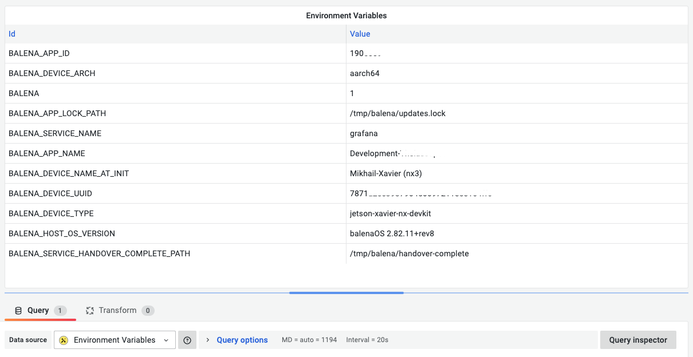

import Video from "@theme/Video";

# Using Environment Variables for Configuration, Provisioning, and Dashboards in Grafana

The number of use cases operating Grafana as a platform to build modern applications is increasing. Compared to a single central Grafana instance, we are looking at multiple distributed installations with new data sources.

<!--truncate-->

One example is the Environment Data Source, which we created for our customer, who uses Balena Cloud, the container-based platform for deploying Internet of Things (IoT) fleets of connected Linux devices. Each IoT device is independent of its own Grafana instance, and each device can be uniquely identified by environment variables exposed within the project.

Watch this video to learn more about the dashboard, global, and environment variables in Grafana.

<Video
  src="https://www.youtube.com/embed/sczRq2lI3e4"
  title="Dashboard, Global and Environment variables."
/>

Before looking at the Environment Data Source, let's examine how you can utilize environment variables in Grafana.

## System Configuration

Grafana has default and custom configuration files. You can customize your Grafana instance by modifying the configuration file or using environment variables. To override an option, use a predefined pattern `GF_<SectionName>_<KeyName>` to name exported variables:

```sh
export GF_DEFAULT_INSTANCE_NAME=my-instance
export GF_SECURITY_ADMIN_USER=owner
export GF_AUTH_GOOGLE_CLIENT_SECRET=newS3cretKey
```

If you are using Docker and Docker Compose, then environment variables can be set in the command line or the `docker-compose.yml` file:

```docker
grafana:
  container_name: grafana
  image: grafana/grafana:latest
  ports:
    - 3000:3000
  environment:
    - GF_AUTH_ANONYMOUS_ORG_ROLE=Admin
    - GF_AUTH_ANONYMOUS_ENABLED=true
    - GF_AUTH_BASIC_ENABLED=false
    - GF_ENABLE_GZIP=true
    - GF_USERS_DEFAULT_THEME=light
```

You can find all available configuration options in the [Documentation](https://grafana.com/docs/grafana/latest/setup-grafana/configure-grafana/).

## Provisioning Grafana

It is possible to use environment variable interpolation in all three provisioning configuration types. The allowed syntax is either `$ENV_VAR_NAME` or `${ENV_VAR_NAME}` and can be used only for values. It is not available in the dashboard's definition files, just the dashboard provisioning configuration.

Example of using environment variables for data source provisioning:

```yaml
datasources:
  - name: Example
    url: http://localhost:$PORT
    user: $USER
    secureJsonData:
      password: $PASSWORD
```

## How to display Environment Variables on the Dashboards?

Surprisingly, we could not find a solution and decided to create a backend data source plugin that retrieves environment variables exposed to the Grafana instance.


In Settings, the data source has the Filter option to avoid exposing unnecessary or secured variables:


## Dashboard Variables

Dashboard variables allow you to create more interactive and dynamic dashboards. Instead of hard-coding things like server, application, and sensor names in your metric queries, you can use variables in their place. Variables are displayed as dropdown lists at the top of the dashboard.

The Environment Data Source supports querying environment variables and returns its value to retrieve metric queries or display them on the dashboard.


## Balena Cloud

Balena is a complete set of tools for building, deploying, and managing fleets of connected Linux devices. As we mentioned, each IoT device in our project provides Grafana with a custom application plugin for end-users.

Variables can be added to the device and assigned to a specific service or all services running on the device. You can use environment variables to store secrets and other sensitive values out of your codebase and configure them when needed.


Employing the Environment Data Source, we can retrieve custom and generic environment variables exposed to the IoT device and display them on Grafana's Home page and improve other dashboards.



## Grafana Catalog

Because of the security risk, the Environment data source can not be included in the Grafana Catalog. It can be installed manually from our Private Repository or downloaded directly from [GitHub](https://github.com/volkovlabs/volkovlabs-env-datasource):

```sh
grafana-cli --repo https://volkovlabs.io/plugins plugins install volkovlabs-env-datasource
```

Any feedback and comments are welcome. Feel free to challenge us with your questions. It helps us to stay sharp!
