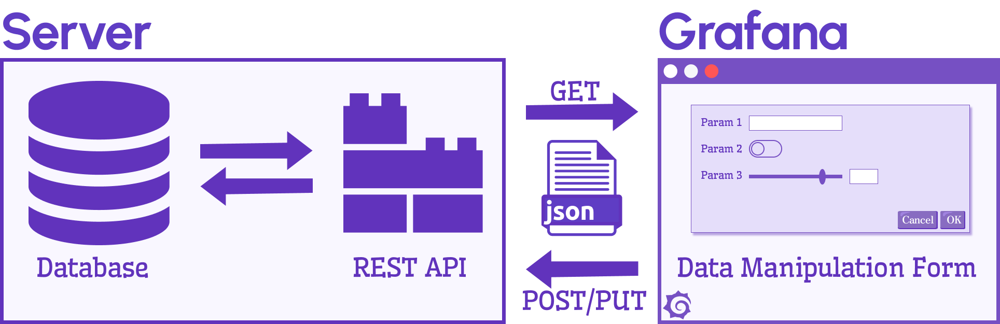
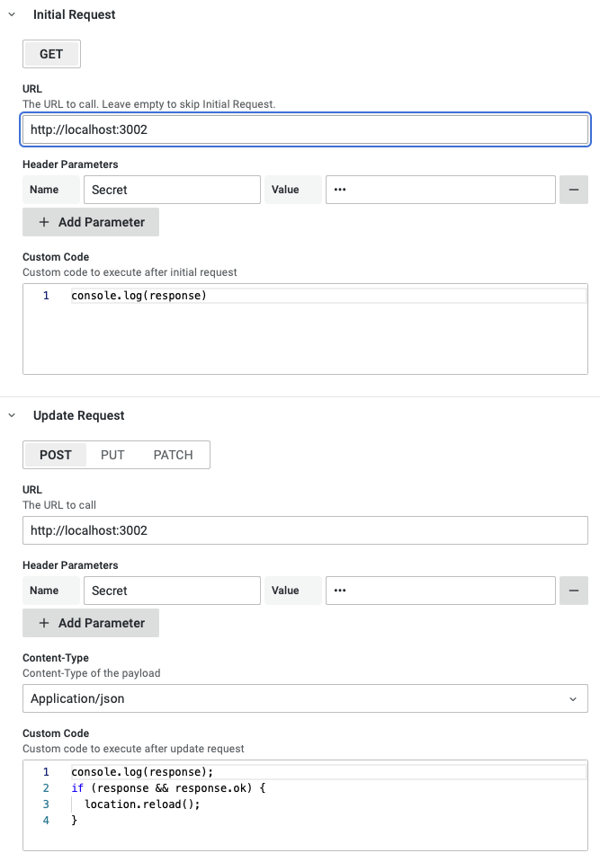
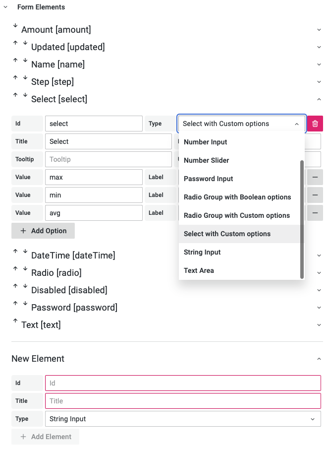
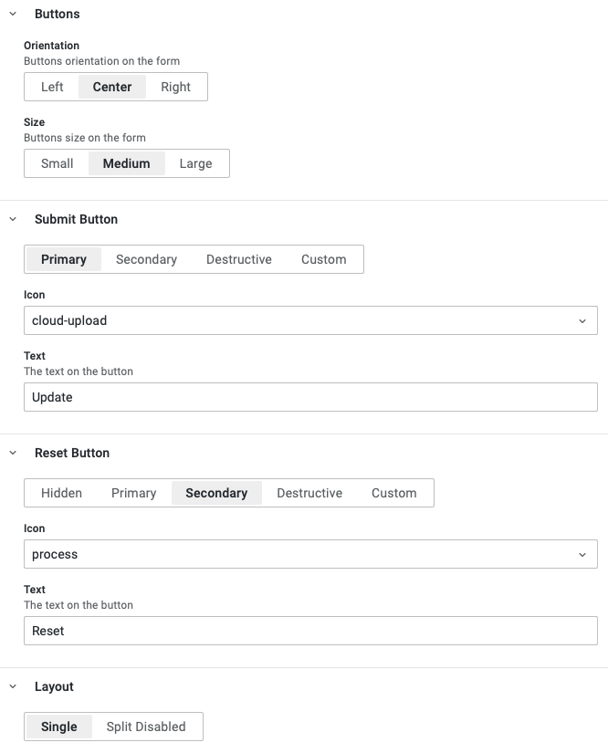
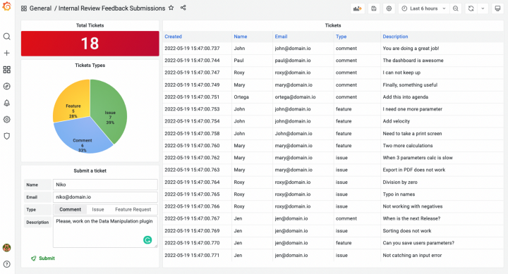

import Image from "@theme/Image";
import Video from "@theme/Video";

# Data Manipulation plugin for Grafana

Working on a commercial project, we created a Data Manipulation panel plugin that can be used to insert, update application data, and modify configuration directly from your Grafana dashboard.

<!--truncate-->

The Data Manipulation panel has been requested by the community multiple times. We decided to open-source it and submit it for review to the Grafana team to include in [the Grafana Catalog](https://grafana.com/grafana/plugins/volkovlabs-form-panel/).

The Data Manipulation Panel is a conceptually new plugin for Grafana. It is the first plugin that allows inserting and updating application data, as well as modifying configuration directly from your Grafana dashboard.

<Video
  src="https://www.youtube.com/embed/DXALVG8GijM"
  title="Manual data entering and User input into Dashboard."
/>

## Architecture

Panel options allow you to specify the URL for GET requests to receive initial values and POST, PUT, or PATCH requests to update values sent as a JSON. Header parameters can be added to secure your REST API calls.



The plugin supports dashboard variables in the URL and header parameters. For example, `http://localhost:3001/${var}`, where `${var}` is a dashboard variable.



You can add the custom Typescript code, which will be executed after the browser's various requests, e.g. `GET`, `POST`, `PUT`, and `PATCH`. For example, we added the browser's location reload in the provided screenshot after a successful `POST` request. Here is the part of the plugin that executes the custom code:

```javascript
const f = new Function( 'options', 'response', 'elements',
'locationService', 'templateService', replaceVariables(code));
try {
  f(options, response, options.elements, locationService, templateSrv);
} catch (error: any) {
  console.error(error);
  setError(error.toString());
}
```

The custom code has access to the Panel options, the response from the REST API call, form elements, and various Grafana services. You can use dashboard variables.

## Form Elements

The Data Manipulation Form panel is actively improving and already supports:

- Date and Time - drop-down to set and adjust date and time.
- Disabled Input - to display values that can't be changed.
- Number Input - to enter numbers with minimum and maximum options.
- Number Slider - Slider element with minimum, maximum, and step options.
- Password Input - to enter sensitive information.
- Radio Group with Boolean options - to select `True` or `False`.
- Radio Group with Custom options - to provide your own options.
- Select with Custom options - similar to Radio Group visualized as drop-down.
- String Input - to enter any alphanumeric values.
- Text Area - a multiline text area with an adjustable number of rows for comments and descriptions.



We plan to include Code Editor, File, and Image Upload elements in upcoming versions. If you are interested in additional elements, please [open an issue in the repository](https://github.com/volkovlabs/volkovlabs-form-panel).

## Customization

The form provides **Submit** and **Reset** buttons which can be customized to use theme-specific sizes, types, icons, and a flexible combination of background and foreground colors.



Form options can be displayed in a single column or split into multiple columns, and each element can be assigned to a specific column. This feature will be available in an upcoming version. The current version allows splitting editable and disabled elements only.

## Feedback submissions

Let's take a look at the example of using the Data Manipulation panel to submit comments, issues, and feature requests integrated into the Application plugin for Theia Scientific.



The Theia Application was designed to be deployed on edge computing devices in a network-constrained environment and was recently presented in a [Grafana blog post](https://grafana.com/blog/2022/04/29/how-theia-scientific-and-volkov-labs-use-grafana-and-ai-to-analyze-scientific-images/).

For a seamless user experience, the feedback submissions form allows users to provide us with valuable feedback for the application. All submissions are stored in the database and sent out using various communication channels.
