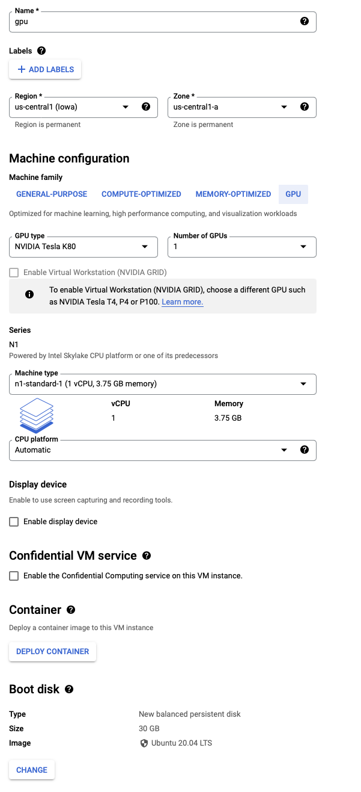

# PyTorch in Ray Docker container with NVIDIA GPU support on Google Cloud

One of the commercial projects we are working on is based on Ray and uses PyTorch to process data using AI models. To create a development environment for the Grafana Application plugin, we built Docker images for the Backend. One of the requirements was to support PyTorch with CPU and NVIDIA GPU in the same image.

<!--truncate-->

Processing AI models with CPU in PyTorch works out of the box and can be an option for the Development environment. Still, it's slow and not applicable for real-time operations or performance testing. To test NVIDIA GPU, we used one of the Google Cloud instances with GPU support.

This article will share our weekend experience building Docker images with [Ray](https://www.ray.io/) and PyTorch on Google Cloud instances with GPU support. Ray is an open-source project that makes it simple to scale any compute-intensive Python workload - from deep learning to production model serving.

[PyTorch](https://pytorch.org/) is an open-source machine learning framework that accelerates the path from research prototyping to production deployment.

## Google Cloud instances with GPU support

If you have never used Google Cloud instances with GPU support in your organization, you will need to increase the quota to start any instances. The default quota for GPU instances is 0. You can learn more about GPU quota and how to increase it in the [Documentation](https://cloud.google.com/compute/resource-usage#gpu_quota).

Different regions and zones provide various NVIDIA GPU models, and some of them are not available when you try to start a new instance. It took us a couple of retries to choose the right mix of GPU model and region to create a new instance. We selected:

- US Central region, Zone A.
- 1 x NVIDIA Tesla K80.
- Type N1-Standard-1 with one vCPU and 3.75Gb memory, which we can upgrade at any time for performance testing up to 8 vCPU.
- Ubuntu 20.04 LTS with 30Gb Size.



We followed the [Google Cloud documentation](https://cloud.google.com/compute/docs/gpus/install-drivers-gpu#verify-windows) for installing GPU drives. Installation using automated scripts took a while, and drivers could not load after a restart. Also, most of the installed packages are not required for our deployment. We use Docker containers and have no plans to run applications on the host machine.

Instead of using provided scripts, we installed the latest version of NVIDIA Drivers for Tesla K80 from the repository:
```sh
sudo apt update
sudo apt install nvidia-driver-470
```

After the installation was completed, the command `nvidia-smi` displayed information about the GPU:


## Support GPU in Docker

After NVIDIA drivers are installed on the host and the command `nvidia-smi` was able to locate GPU, we could move forward to install Docker, Docker Compose, and NVIDIA Toolkit:

```sh
sudo apt install docker-compose
distribution=$(. /etc/os-release;echo $ID$VERSION_ID) \
   && curl -s -L https://nvidia.github.io/nvidia-docker/gpgkey | sudo apt-key add - \
   && curl -s -L https://nvidia.github.io/nvidia-docker/$distribution/nvidia-docker.list | sudo tee /etc/apt/sources.list.d/nvidia-docker.list

sudo apt update
sudo apt-get install -y nvidia-docker2

sudo systemctl restart docker
```

At this point, a working setup could be tested by running a base CUDA container and you should see the same output:

```sh
docker run --rm --runtime=nvidia nvidia/cuda:11.0-base nvidia-smi
```


You can learn more about the NVIDIA Container toolkit installation in the [Documentation](https://docs.nvidia.com/datacenter/cloud-native/container-toolkit/install-guide.html).

## Using Docker Compose with GPU support

The Docker-compose version 1.25 does not support NVIDIA runtime configuration and should be upgraded to version 1.27 or later. The latest version of Docker Compose can be downloaded from GitHub:

```sh
sudo curl -L "https://github.com/docker/compose/releases/download/1.29.2/docker-compose-$(uname -s)-$(uname -m)" -o /usr/local/bin/docker-compose
```

For our tests, we created a file `docker-compose.yml` to run `nvidia-smi` command and image based on Ray with a test PyTorch application. The environment variable `NVIDIA_VISIBLE_DEVICES: all` is essential for PyTorch to see all GPU devices.

```yaml
version: "2"
services:
  nvidia:
    image: nvidia/cuda:11.0-base
    runtime: nvidia
    command: nvidia-smi
  app:
    container_name: app
    build:
      context: ./app
    runtime: nvidia
    environment:
      NVIDIA_VISIBLE_DEVICES: all
```

To build a Docker image based on the latest version of Ray, we created `Dockerfile`:

```docker
FROM rayproject/ray:1.10.0-py38

## Working directory
WORKDIR /app
COPY requirements.txt ./

## Install Requirements
RUN pip3 install -r requirements.txt

## Copy script
COPY ./app.py ./

## Start
CMD ["python3", "./app.py"]
```

File `requirements.txt` to install the 1.10.0 version of the PyTorch:

```python
torch==1.10.0
```

Here is the application we used to test PyTorch with CUDA support:

```python
import torch

print("CUDA Available:", torch.cuda.is_available())
print("CUDA Devices count:",torch.cuda.device_count())
print("CUDA Version: ", torch.version.cuda)

device = "cuda" if torch.cuda.is_available() else "cpu"
device = torch.device(device)
```

Let's build and start our application:

```sh
root@gpu:/app# docker-compose build app
Building app
Sending build context to Docker daemon  4.096kB
Step 1/6 : FROM rayproject/ray:1.10.0-py38
---> 2f51f6f631dd
Step 2/6 : WORKDIR /app
---> Using cache
---> bd1c46292a36
Step 3/6 : COPY requirements.txt ./
---> Using cache
---> 360bbc5e895d
Step 4/6 : RUN pip3 install -r requirements.txt
---> Using cache
---> 3379070d95d2
Step 5/6 : COPY ./app.py ./
---> 5661ce1b61fc
Step 6/6 : CMD ["python3", "./app.py"]
---> Running in 75c604e59d9f
Removing intermediate container 75c604e59d9f
---> cdd7582c3ee2
Successfully built cdd7582c3ee2
Successfully tagged app_app:latest

root@gpu:/app# docker-compose up app
Recreating app ... done
Attaching to app
app        | CUDA Available: True
app        | CUDA Devices count: 1
app        | CUDA Version:  10.2
app exited with code 0
```

We successfully tested PyTorch with CUDA 10.2 and 11.4 in the Docker containers on the Google Cloud instance with GPU. At this point, we are ready to add the actual application with additional Python requirements and build a full-featured Backend image.

The next step is to create a [Custom Data Source for Grafana using one of our Templates](/plugins/grafana) and continue developing custom pages and panels to interact with the Backend.
