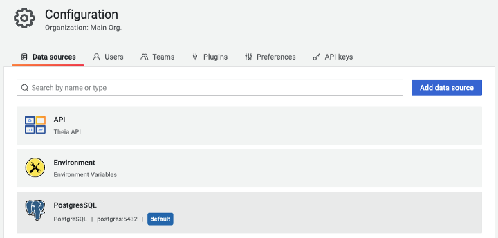
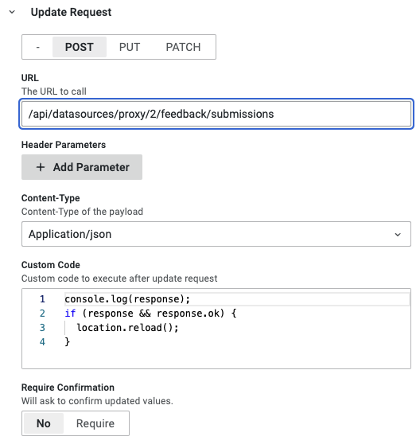

# How to connect the Data Manipulation plugin for Grafana to API Server

We understand the risk of data manipulation and take security concerns seriously. This article explores three secure ways to connect the Data Manipulation panel to the API Server.

<!--truncate-->

The [recent article](data-manipulation-panel-plugin-for-grafana-97f9af2c67e0) and Youtube video showcased various use cases to bring your Grafana Dashboard game to the next level using the Data Manipulation plugin. This panel can insert, update application data, and modify configuration directly from your Grafana dashboard.

<iframe width="100%" height="500" src="https://www.youtube.com/embed/DXALVG8GijM" title="Base64 Image/PDF panel" frameBorder="0" allow="accelerometer; autoplay; clipboard-write; encrypted-media; gyroscope; picture-in-picture" allowFullScreen></iframe>

Before continuing to read, look at the introduction article to get familiar with the Data Manipulation plugin and its features.

## Architecture

Data Manipulation panel options allow you to specify the URL for `GET` requests to receive initial values and `POST`, `PUT`, or `PATCH` requests to update values sent as a JSON.


There are three methods to connect the panel to the API Server:

- Publicly available server with additional header parameters (CORS restrictions).
- API exposed using NGINX in the same domain as the Grafana server (CORS ready).
- Custom Data Source using HTTP Proxy.

Let's take a look at each of them closely.

## Publicly available server

If your server is publicly available or in a private network, the simplest and easiest way is to connect to the API Server directly. Header parameters can be added to secure your REST API calls.

The disadvantage of this method is that API requests are exposed to the end-users. The REST API server should allow Cross-Origin Resource Sharing (CORS).

> Cross-Origin Resource Sharing (CORS) is an HTTP-header based mechanism that allows a server to indicate any origins (domain, scheme, or port) other than its own from which a browser should permit loading resources.

We already explained how to configure the panel in the video mentioned above. If this method works for your use case, you can find server code examples in the plugin's GitHub repository:

```javascript reference
https://github.com/VolkovLabs/volkovlabs-form-panel/blob/main/server/server.ts
```

## Use NGINX reverse proxy

We recommend running Grafana behind NGINX reverse proxy for an additional security layer. The reverse proxy also allows us to expose additional API endpoints and static files in the same domain, which makes it CORS-ready.


To learn how to configure Grafana to run behind a reverse proxy, take a look at the Grafana tutorial [Run Grafana behind a reverse proxy](https://grafana.com/tutorials/run-grafana-behind-a-proxy/).

You can add a section to redirect requests /api/data-form to the docker container or server process in the NGINX configuration file. The rest of the requests should be redirected to Grafana. The API server operates on the specific IP address and port accessible by NGINX, and end-users have no direct access to it.

```nginx
server {
  listen 443 ssl;

  include /etc/nginx/conf.d/http_headers.conf;

  ssl_certificate /etc/nginx/ssl.crt;
  ssl_certificate_key /etc/nginx/ssl.key;

  ssl_session_cache builtin:1000 shared:SSL:10m;
  ssl_protocols TLSv1.2;
  ssl_ciphers EECDH+AESGCM:EDH+AESGCM:AES256+EECDH:AES256+EDH;
  ssl_prefer_server_ciphers on;

  location / {
    proxy_pass http://${GRAFANA_HOST}:${GRAFANA_PORT};
    include /etc/nginx/conf.d/proxy.conf;
  }

  location /api/data-form {
   proxy_pass http://${API_HOST}:${API_PORT};
   include /etc/nginx/conf.d/proxy.conf;
  }
}
```

This option is CORS-ready as an endpoint is a part of the same domain, and API can be secured using Grafana or any other authentication method.

## Custom Data Source using HTTP Proxy

The last method is to use a custom Data Source with HTTP Proxy, which you can create following the Grafana tutorial [Add authentication for data source plugins](https://grafana.com/docs/grafana/latest/developers/plugins/add-authentication-for-data-source-plugins/#add-a-dynamic-proxy-route-to-your-plugin) and [our data source template](https://github.com/volkovlabs/volkovlabs-abc-datasource).

> Grafana sends the proxy route to the server, where the data source proxy decrypts any sensitive data and interpolates the template variables with the decrypted data before making the request.

Data sources with HTTP Proxy keep authentication information hidden from end-user performing server-side requests. To retrieve and update data using HTTP Proxy, the required endpoint should be defined in the `routes` section of the `plugin.json` configuration file.

```json
{
  "method": "GET",
  "path": "feedback",
  "reqRole": "Viewer",
  "url": "{{ .JsonData.url }}/api/feedback"
},
{
  "method": "POST",
  "path": "feedback",
  "reqRole": "Viewer",
  "url": "{{ .JsonData.url }}/api/feedback"
},
```

Every data source configured in Grafana has a sequential number and unique-string identifiers. In our case, API has an identifier `2` which we will be using for the proxy requests.



Let's set up the Update Request options for the Data Manipulation panel. We set the URL as `/api/datasources/proxy/2/feedback/submissions` to proxy requests to the API Server instead of accessing directly.



We continue to improve the Data Manipulation panel and gather feedback from the community looking for new use cases. The upcoming version of the panel will be based on the Grafana 9 toolkit and will continue to support Grafana 8.5+ versions.
