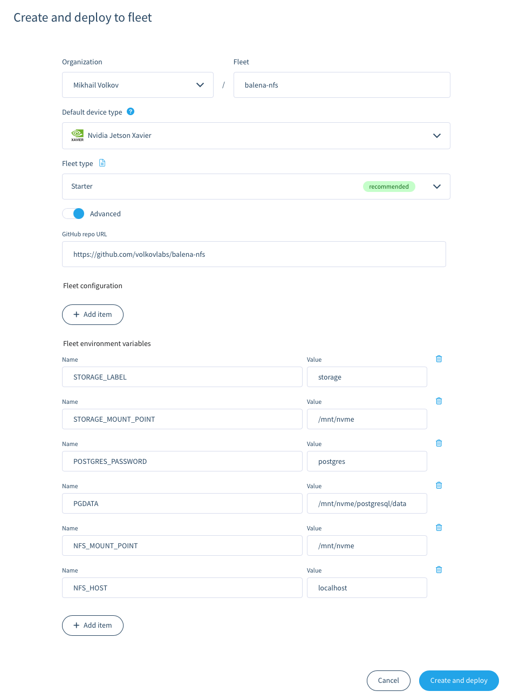

# Balena NFS Server Project

A week ago, Volkov Labs and Theia Scientific published a [blog post about using NFS (Network File System) Server](https://www.balena.io/blog/using-nfs-server-to-share-external-storage-between-containers-balena/) as a solution to share external storage between containers on balenaCloud. This problem is long-standing, and this article demonstrates a solution.

<!--truncate-->

Let's set the stage, aka the problem.

> Following containerization best practices, the Theiascope™ platform is separated into containers deployed in host network mode and interacts with each other using TCP and/or UDP ports. The Theia web application running on the Theiascope™ hardware powered by balenaOS deals with massive data, where exporting results can reach gigabytes in size. To prevent caching and delay in transferring files between containers, each container should have access to the same storage.

<iframe width="100%" height="500" src="https://www.youtube.com/embed/_kyNSLeAT84" title="Using Network File System (NFS) in Balena | Share external storage between containers" frameBorder="0" allow="accelerometer; autoplay; clipboard-write; encrypted-media; gyroscope; picture-in-picture" allowFullScreen></iframe>

The blog post described `Dockerfile` with the `Entrypoint` scripts we used to build containers for the NFS Server. We also explained how NFS clients indefinitely try to mount NFS exports to ensure that NFS storage is available before the application starts.

We encourage you to read the article before continuing.

This article will showcase the Project registered in the [balenaHub](https://hub.balena.io/organizations/volkovlabs/projects/balena-nfs), which you can try by forking.

## balenaCloud and balenaHub

[BalenaCloud](https://www.balena.io/cloud/) is the container-based platform for deploying IoT (The Internet of things) fleets. It allows you to develop and deploy IoT fleets quickly and remotely update and monitor your devices and code from anywhere in the world.

Balena created a [balenaHub](https://hub.balena.io) a couple of years ago to make life easier for everyone working with IoT, edge, and physical computing. If you have never worked with balena before, please look at the video from Ayan Pahwa, Developer Advocate for balena.

<iframe width="100%" height="500" src="https://www.youtube.com/embed/1B2gyBSuvlE" title="Getting started with balena - add your first device to balenaCloud" frameBorder="0" allow="accelerometer; autoplay; clipboard-write; encrypted-media; gyroscope; picture-in-picture" allowFullScreen></iframe>

balenaHub provides plenty of community fleets for you to add your device for testing and experimenting. Some fleets are not joinable and are called Projects. You can easily fork them and start exploring as other fleets.

## NFS Project architecture

Balena NFS Server and client project consists of three containers and can be forked from the [balenaHub project's page](https://hub.balena.io/organizations/volkovlabs/projects/balena-nfs).

First, the project includes an NFS Server built on top of the PostgreSQL Alpine image. It uses OpenRC (dependency-based init system) to manage NFS services, which is the recommended way to start NFS service for Alpine Linux.

Second, it includes NFS Client build on top of the NGINX Alpine image with a custom Entrypoint script to mount NFS export and provide direct access to the files on the storage.

The project supports various environment variables to specify storage labels and mount points that are defined in the `balena.yml` configuration file:

- STORAGE_LABEL (`storage`) - External storage Id, if not found, `tmpfs` will be used instead.
- STORAGE_MOUNT_POINT (`/mnt/nvme`) - Local Mount Point to mount storage.
- POSTGRES_PASSWORD (`postgres`) - Password for the PostgreSQL.
- PGDATA (`/mnt/nvme/postgresql/data`) - PostgreSQL path on the storage.
- NFS_MOUNT_POINT (`/mnt/nvme`) - NFS mount point to mount NFS drive in the NGINX container.
- NFS_HOST (`localhost`) - NFS host should be `localhost` for the local container in the NGINX container.

When you fork the project, you will have a chance to update all environment variables.

## Grafana Dashboard

To manage running services and display device configuration, we added Grafana with the Balena Application plugin. The developed dashboard displays journal logs in real-time and will help troubleshoot any issues.

It's comparable to the functionality of the balenaCloud UI and can be extremely valuable in a network-constrained environment when the device is not connected to the Internet.

You can access Grafana from the local network or public URL if it's enabled in the device configuration. You can learn more about the Balena Application plugin in the [Documentation](/plugins/volkovlabs-balena-app).
