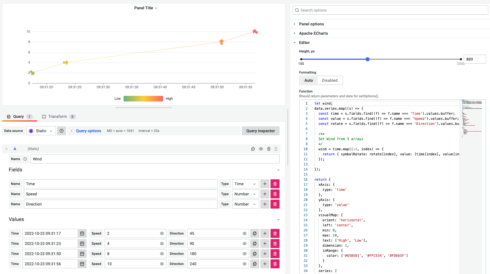
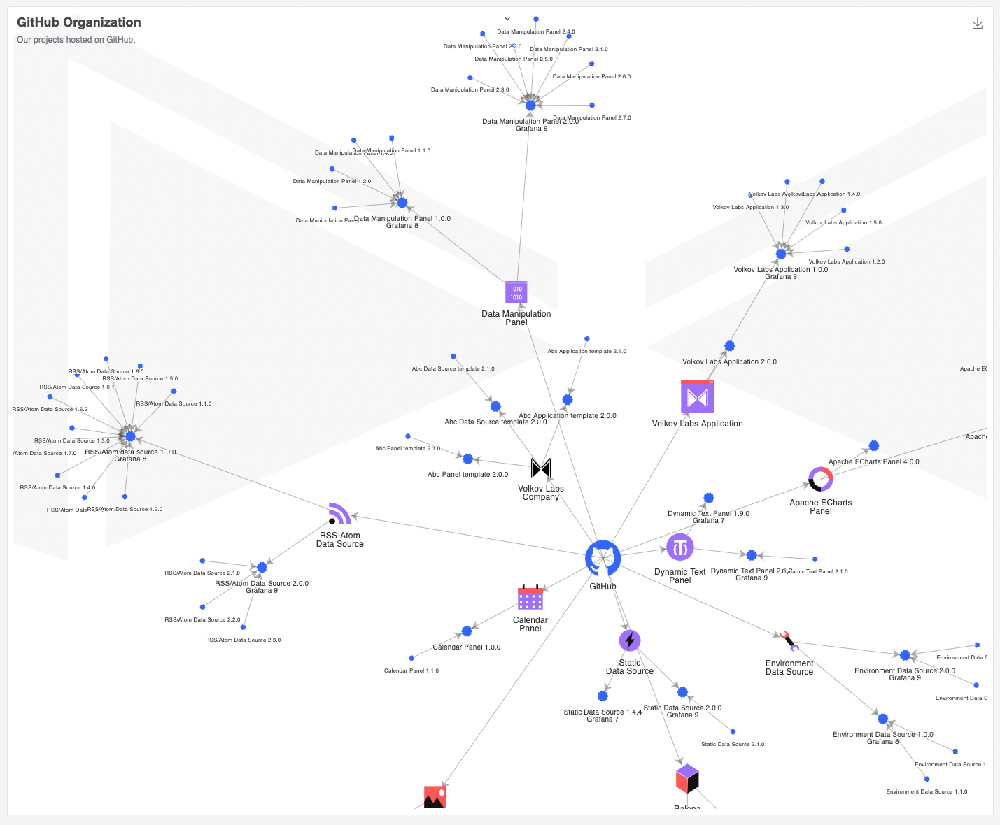

# The missing plugin to create business and industrial charts in Grafana

Grafana is a de-facto observability visualization tool with various chart panels and many community plugins like Plotly. Still, no none of them can compare with Apache ECharts flexibility.

<!--truncate-->

Apache ECharts is a free, powerful charting and visualization library offering easy ways to add intuitive, interactive, and highly customizable charts. It is written in pure JavaScript and based on zrender, a new lightweight canvas library.

The Apache ECharts panel is a plugin for Grafana that allows you to use the Apache ECharts library on the Grafana dashboard. The original plugin was developed for Grafana 6.3/7.0 and ECharts 4.9.0. It has not been maintained since then.

Volkov Labs adapted and updated it based on the latest Grafana 9 with ECharts 5.3.3, introducing new features like Monaco Code Editor and supporting SVG and Canvas renderer.

The Apache ECharts panel was recently submitted to the Grafana Marketplace. Meanwhile, it can be installed manually from our [Private Repository](/plugins/intro) or [downloaded directly from GitHub](https://github.com/volkovlabs/volkovlabs-echarts-panel).

## Apache ECharts libraries

Apache ECharts is a mighty tool. You do not need a senior Javascript developer to start displaying modern-looking animated visualizations. And if your use case is unique, Apache ECharts provides an excellent venue to develop visualizations of any complexity.

The Apache ECharts panel for Grafana is a bridge that has been missing and finally arrived. You can use the benefits of two great open-source products - Grafana and Apache ECharts in one solution tailored to your needs.

<iframe width="100%" height="500" src="https://www.youtube.com/embed/DxqCrBEmrQw" title="Apache Echarts panel for Grafana | How to create modern dashboards in Grafana | ECharts Tutorial" frameborder="0" allow="accelerometer; autoplay; clipboard-write; encrypted-media; gyroscope; picture-in-picture" allowfullscreen></iframe>

According to the [press release](https://www.globenewswire.com/fr/news-release/2021/01/26/2164391/17401/en/The-Apache-Software-Foundation-Announces-Apache-ECharts-as-a-Top-Level-Project.html), "Apache ECharts is in use at Alibaba, Amazon, Baidu, GitLab, Intel, and Tencent, among others, as well as solutions such as Apache Superset data visualization software."

The project continues to grow in popularity, with more than 50,000 stars on GitHub and 450,000 weekly downloads on [npm](https://www.npmjs.com/package/echarts).

## Wind Speed

From visualizing wind speed with an arrow displays direction and color scale to seamlessly navigating a world map looking at countries, and switching to regions using dynamic options. Apache ECharts can do both and everything in between.

We were looking for a Grafana plugin to visualize complex directed graphs and were fascinated by how Apache ECharts produce it effortlessly.

<iframe width="100%" height="500" src="https://www.youtube.com/embed/BcW7iyTadWE" title="Can Apache ECharts render a directed graph? | Graph customization" frameborder="0" allow="accelerometer; autoplay; clipboard-write; encrypted-media; gyroscope; picture-in-picture" allowfullscreen></iframe>

## Directed Graph Tutorial

Data visualizations can and should be done in style. In the 30 minutes tutorial, Daria explained step-by-step how we created the project to visualize all our activities for this year across Medium, GitHub, YouTube, and diverse external resources.

<iframe width="100%" height="500" src="https://www.youtube.com/embed/e3VHgpuzEF0" title="Build directional graph in Grafana using Apache ECharts | Tutorial part 1" frameborder="0" allow="accelerometer; autoplay; clipboard-write; encrypted-media; gyroscope; picture-in-picture" allowfullscreen></iframe>

<iframe width="100%" height="500" src="https://www.youtube.com/embed/oM7XAVlsOio" title="Build directional graph in Grafana using Apache ECharts | Tutorial part 2" frameborder="0" allow="accelerometer; autoplay; clipboard-write; encrypted-media; gyroscope; picture-in-picture" allowfullscreen></iframe>

## Live Updates [live.volkovlabs.io](https://live.volkovlabs.io)

Let's take a look at directed graphs displaying our activities related to Medium and GitHub. Graphs are built dynamically, and we constantly update them with new articles and releases daily.

Directed graphs use `force` layout and automatically adjust based on the activities and connections. Elements have different icons, and style depending on the resources. Clicking on the elements allows you to open an external URL or take a closer look at the subgraphs.

You are welcome to take a look and learn about our [Grafana plugins at Live Updates](https://live.volkovlabs.io/d/mbCp3qenz/github-organization?orgId=1).

## Conclusion

Since we adapted and [released a [new version](/plugins/volkovlabs-echarts-panel/release) of the Apache ECharts plugin, we have received overwhelming feedback from the community and helped customers migrate from an older version.

Volkov Labs just finished a project migrating industrial dashboards based on Plotly to Apache ECharts. It also allowed us to add features like a custom toolbox button to dynamically change the charts and support the multiple Y-axis the customer was looking for.
