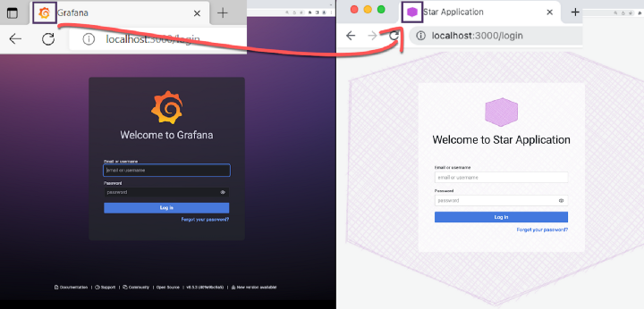
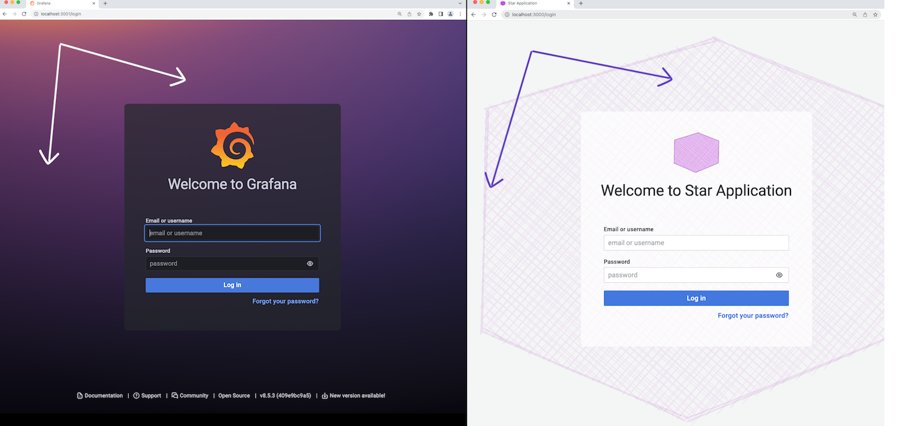
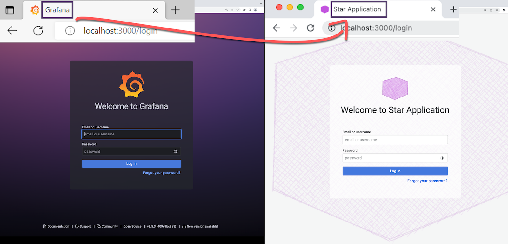
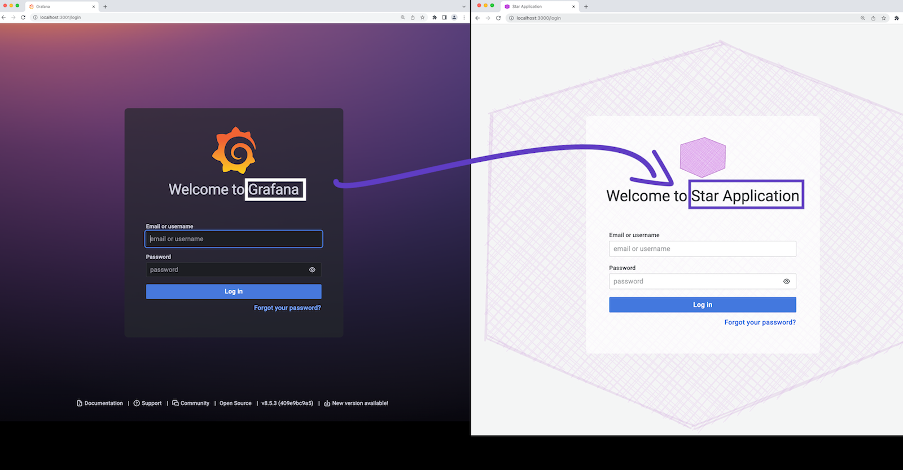
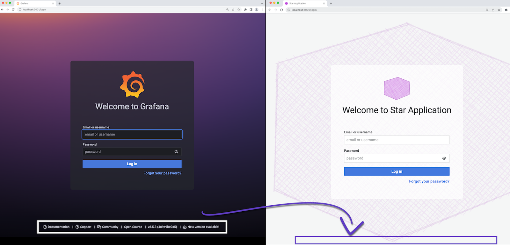

# How to customize the Grafana user interface

In this article, we collected various valuable commands to help you play with the Grafana in your style.

If you are here, you probably know what Grafana is and have already been playing with it for quite some time. And you are already quite aware that Grafana is a remarkable open-source tool for observability.

<!--truncate-->

The installation of Grafana directly on the operating system takes a minute or two. However, working with [Grafana in a Docker container](https://grafana.com/docs/grafana/latest/setup-grafana/installation/docker/) is more advantageous.

<iframe width="100%" height="500" src="https://www.youtube.com/embed/xTQpV7B700w" title="How to Install Grafana for Data Analysts and Data Scientists" frameborder="0" allow="accelerometer; autoplay; clipboard-write; encrypted-media; gyroscope; picture-in-picture" allowfullscreen></iframe>

Once installed, Grafana delivers a broad spectrum of inbuilt visualization panels and data sources. You most likely know that if the out-of-the-box features do not yet endure your use case, the friendly community has plenty of add-ons in the shape of plugins you can download from the Grafana Catalog.

Starting from Grafana 8, access to Grafana Catalog was made a click away when the Plugins section was added under the Configuration menu. Following that path, you can find and install the extra functionality on top of the standard features in a blink of an eye.

So, here you are, at the point of knowing that Grafana architecture and functionality suit your needs and realizing the necessity to adjust the basic graphical elements to make your application look more like your own.

The truth is the fundamental UI components are pre-defined. There is no straightforward way to adjust them.

<iframe width="100%" height="500" src="https://www.youtube.com/embed/3GRoa8TzIxY" title="How to customize Grafana interface | Change titles, icons, footer, default dashboard | Grafana 9" frameborder="0" allow="accelerometer; autoplay; clipboard-write; encrypted-media; gyroscope; picture-in-picture" allowfullscreen></iframe>

In this article, we collected all commands that will help you to play with UI in style. Let's go!

:::info

First and foremost, we recommend working with Grafana in a Docker container. Once it is settled, all that is left is to rebuild your current container, ensuring to include the following commands.

:::

## Default theme​

There are two types of people in this world: people with the Light theme preference or the Dark one. Grafana started with dark colors, initially designed to provide for observability demand.


The Light option was introduced in version 7 and became equally famous as the Dark one. This is the only setting that is configurable in a user profile. You can, however, make the UI style coherent by specifying the default theme for the whole Docker container by clearly assigning a value to the following environment variable:

```docker
ENV GF_USERS_DEFAULT_THEME=light
```

## Home Dashboard​


In order to set the dashboard of your choice as a Home dashboard, you would need to replace the `default.json` file located in `../usr/share/grafana/public/dashboards/default.json` with the file containing your code.

You can do so by running the following command:

```docker
COPY dashboards/home.json /usr/share/grafana/public/dashboards/default.json
```

If the dashboard is ever modified, the Docker container has to be rebuilt with a new JSON file. If your dashboard is a part of the Application plugin, you can override the environment variable to specify a new file.

```docker
ENV GF_DASHBOARDS_DEFAULT_HOME_DASHBOARD_PATH=/var/lib/grafana/plugins/volkovlabs-balena-app/dashboards/supervisor.json
```

## Disable Alerting and Explore​

More and more applications are being built to utilize Grafana as a platform for data visualization. Those applications do not require Alerting nor Explore components. To simplify your Grafana interface, consider disabling those features by including the following environment variables:

```docker
ENV GF_EXPLORE_ENABLED=false
ENV GF_ALERTING_ENABLED=false
ENV GF_UNIFIED_ALERTING_ENABLED=false
```

## Sanitize HTML​

HTML sanitizing is enabled by default. If you need to use the HTML tags in the panels, this command is for you:

```docker
ENV GF_PANELS_DISABLE_SANITIZE_HTML=true
```

## Anonymous Authentication​

In some cases, you might need to remove the login page completely and make a dashboard available for the public. For that, you would need to allow Anonymous access.

```docker
ENV GF_AUTH_ANONYMOUS_ENABLED=true
ENV GF_AUTH_BASIC_ENABLED=false
```

## Bookmark Icon (Favicon)​

The favicon is the icon next to the application title on the browser tab.



In order to have your own, you can replace `fav32.png` and `apple-touch-icon.png` with the images of your choice. Use the following command for that:

```docker
COPY img/fav32.png /usr/share/grafana/public/img/fav32.png
COPY img/fav32.png /usr/share/grafana/public/img/apple-touch-icon.png
```

## Logo​

The logo on the Login page is the first graphical element that users want to change.

The big Grafana icon, the first image that draws users' attention when they open the application, can be customized by substituting the `grafana_icon.svg` file located in `../usr/share/grafana/public/img/`.

```docker
COPY img/logo.svg /usr/share/grafana/public/img/grafana_icon.svg
```

## Login Background​



When customizing the background image, replace images for both themes. You can go with the same picture, but both files need to be replaced.

```docker
COPY img/background.svg /usr/share/grafana/public/img/g8_login_dark.svg
COPY img/background.svg /usr/share/grafana/public/img/g8_login_light.svg
```

## Javascript​

The application title (the name that appears on the browser tab), login page title, and bottom-page links are trickier than others. The files keeping those settings are scattered in various locations depending on the Grafana version.

To simplify customization, we use a Regex pattern to find all occurrences and alter them accordingly.

### Application Title​



```docker
RUN find /usr/share/grafana/public/build/ -name *.js -exec sed -i 's|o(l,"AppTitle","Grafana")|o(l,"AppTitle","Star Application")|g' {} \;
```

### Login Title



```docker
​RUN find /usr/share/grafana/public/build/ -name *.js -exec sed -i 's|o(l,"LoginTitle","Welcome to Grafana")|o(l,"LoginTitle","Welcome to Star Application")|g' {} \;
```

### Login Footer​



```docker
RUN find /usr/share/grafana/public/build/ -name *.js -exec sed -i 's|{text:"Documentation",icon:"document-info",url:"https://grafana.com/docs/grafana/latest/?utm_source=grafana_footer",target:"_blank"},{text:"Support",icon:"question-circle",url:"https://grafana.com/products/enterprise/?utm_source=grafana_footer",target:"_blank"},{text:"Community",icon:"comments-alt",url:"https://community.grafana.com/?utm_source=grafana_footer",target:"_blank"}||g' {} \;
RUN find /usr/share/grafana/public/build/ -name *.js -exec sed -i 's|{text:`${e.edition}${a}`,url:t.licenseUrl}||g' {} \;
RUN find /usr/share/grafana/public/build/ -name *.js -exec sed -i 's|{text:`v${e.version} (${e.commit})`}||g' {} \;
RUN find /usr/share/grafana/public/build/ -name *.js -exec sed -i 's|{id:"updateVersion",text:"New version available!",icon:"download-alt",url:"https://grafana.com/grafana/download?utm_source=grafana_footer",target:"_blank"}||g' {} \;
```

## Docker file

If you did not find the configuration you need, please, check our docker file on GitHub.

```docker reference
https://github.com/VolkovLabs/volkovlabs-app/blob/main/Dockerfile
```

We constantly update it with all the latest configuration commands we were able to identify.
