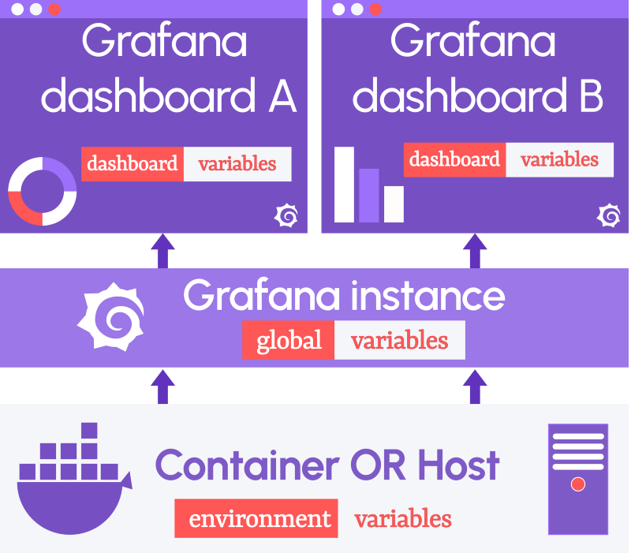
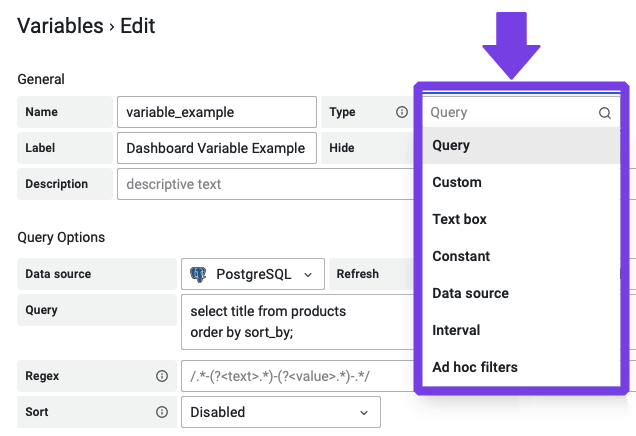

# Grafana variables at a glance, Environment data source explained

After a brief acquaintance with Grafana in sandboxes, production application developers come to the need to work with variables serving different architectural levels. This article outlines three logical levels with corresponding variables and their purposes.

<!--truncate-->

Let's start with the schema below. It provides a fantastic summary of the subject. Dashboard variables serve the analytical dashboards, and global Grafana variables rule in the Grafana instance. Environment variables help in configuring system processes where Grafana is installed.



The YouTube version of this article is on our channel.

<iframe width="100%" height="500" src="https://www.youtube.com/embed/sczRq2lI3e4" title="Grafana variables | Dashboard, Global and Environment variables | Environment Data Source" frameBorder="0" allow="accelerometer; autoplay; clipboard-write; encrypted-media; gyroscope; picture-in-picture" allowFullScreen></iframe>

## Dashboard variables

As the name implies, they are created for a dashboard. Only users with **edit** permissions or higher can maintain them. The dashboard variables configuration menu is located in the Dashboard settings, Variables menu.


Once a variable is created, it is displayed on the top of your dashboard as a drop-down list unless you made it hidden. Multiselection and Select All are optional and effortlessly configurable in the Variable management panel.


To reference a dashboard variable in the queries and panels' code, add a $ (dollar sign) as a prefix.


Most of the time a dashboard variable plays a filter role to limit the displayed data on your panels. If that is the purpose, add it to all your dashboard queries accordingly.



Any dashboard variable is a one-dimensional array of data elements. They could be:

### Hard-coded

Meaning setup when you create a variable. The types for these are:
- Constant. It is one value. Example: 1.
- Custom. It is many values. Example: 1, 2, 3, 56.
- Interval. It is a built-in Grafana type designed to use as a time interval parameter. Examples are `500ms`, `30m`, `1h`, `6h`, `1d`, `14d`, etc.

### Text box

I am not aware of a good business case for the use of this one. If you do, please, share in the comments section. This type of dashboard variable allows the user to enter any value in a text box.

One concerning issue with that it is not a foolproof concept. A dashboard creator would need to add an extra validation for any limitation of characters to ensure meaningful parameters.

The other concerning detail, this type also might give a wrong impression that the entered value can be stored in the data source. It is not true.

The time span of the entered value is limited until the next dashboard refresh. The text box is just plainly what it is, the values are not stored anywhere, and the user can not reuse them without entering them again, nor could they be sent down the pipeline for processing.

### Query
This is my favorite type of dashboard variable. They are populated from any connected data source according to your query.

## Grafana Global variables

Grafana Global variables are read-only and designed to store the statuses of the working Grafana instance. You can think of them as process indicators, for example, logged user name `$__user` or organization name `$__org`.

You can find the complete list of all global variables in the [Grafana Documentation](https://grafana.com/docs/grafana/v9.0/variables/variable-types/global-variables/).

## Container/Host environment variables

Grafana could either be installed in a Docker container or directly on the operating system. YouTube video demonstrating two types of Grafana installation - in a Docker container and Windows/Mac.

<iframe width="100%" height="500" src="https://www.youtube.com/embed/xTQpV7B700w" title="How to Install Grafana for Data Analysts and Data Scientists" frameborder="0" allow="accelerometer; autoplay; clipboard-write; encrypted-media; gyroscope; picture-in-picture" allowfullscreen></iframe>

In both types of installation, an environment variable is a key-value parameter that is designed to either capture a descriptive system element or value to impact the running process. In other words, those variables can keep the system configuration secrets and statuses. That imposes the need for extra caution while working with them.

## Environment Data Source

To stay out of trouble, Grafana core chose not to support environment variables at this time. Yet, many industrial cases require the ability to display environment variables, for instance, in cases where the goal is to manage numerous remote devices.

Following the community demand, the Environment data source was created to supplement that ability. Employing the Environment data source allows you to display the environment variables of all your devices in one spot, the Grafana dashboard.

The way to install the Environment data source is to use Grafana CLI and run the following command.

```sh
grafana-cli - repo https://volkovlabs.io/plugins plugins install volkovlabs-env-datasource
```

More information about features and installation can be found in the [documentation](/plugins/volkovlabs-env-datasource).

For demo purposes below, I use the standard Table panel. Here is what the list of all my environment variables looks like:


To make the environmental data source more secure, you can restrict the variables that are allowed to be shown in the Environment data source configuration. For the endless possibilities, the filter utilizes a regex pattern


One more exciting thing to point out. Any environment variable your dashboard gets access to via the Environment data source can be used as a dashboard variable!

For that, when you create a dashboard variable, select the Environment data source.


## Conclusion

Dashboard, Global, and Environment Variable are valuable instruments to make your dashboard interactive.