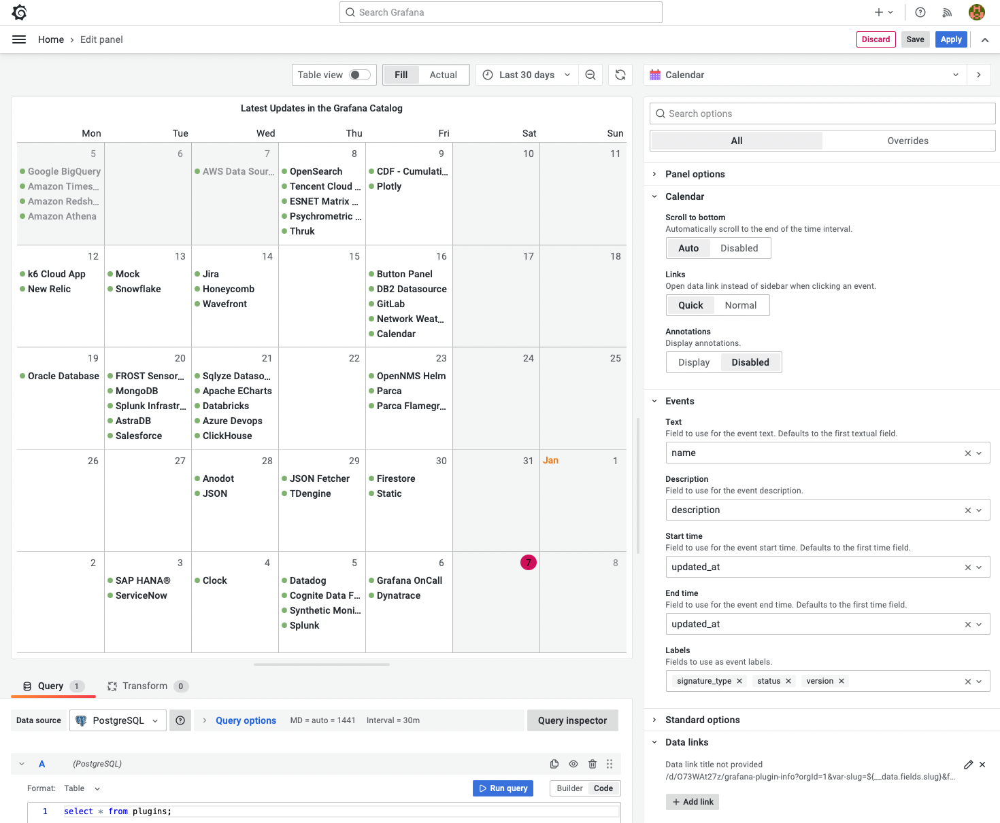

# Calendar Panel 1.1.0

A new maintenance release of the Calendar panel 1.1.0 was released today. In this version

- Updated to the latest Grafana toolkit 9.3.1.
- Added Annotations support.
- Refactored legacy code, and increased test coverage.

<!--truncate-->

We have already started working on the upcoming version to finish refactoring, fix outstanding issues, and looking forward to your feedback.



## Getting Started

The calendar panel can be installed from the [Grafana Catalog](https://grafana.com/grafana/plugins/marcusolsson-calendar-panel/) or utilizing the Grafana command line tool. For the latter, use the following command:

```bash
grafana-cli plugins install marcusolsson-calendar-panel
```

## YouTube Tutorial

The Calendar visualization panel is a Grafana plugin created to display calendar events from data sources.

<iframe width="100%" height="500" src="https://www.youtube.com/embed/iPJ122x0oos" title="Calendar plugin for Grafana tutorial | Step by step | JSON API plugin example" frameBorder="0" allow="accelerometer; autoplay; clipboard-write; encrypted-media; gyroscope; picture-in-picture" allowFullScreen></iframe>

## Release Notes

### Breaking changes

Refactoring may introduce breaking changes. Please test before upgrading in Production.

### Features / Enhancements

- Update Panel options in README (#53)
- Add Youtube tutorial for Calendar with JSON API data source (#54)
- Update CI to Node 16 and Synchronize with Release workflow (#56)
- Update to Grafana 9.2.2 (#57)
- Code Refactoring (#58)
- Update to Grafana 9.3.1 (#59)
- Update CI to upload signed artifacts (#60)
- Refactor panel options and increase test coverage (#61)
- Add annotation support (#8)
- Refactoring and Removing legacy code (#62)
- Refactor Panel Options and add Annotations options (#63)

## Feedback

We love to hear from you. There are various ways to get in touch with us:

- Ask a question, request a new feature, and file a bug with [GitHub issues](https://github.com/volkovlabs/volkovlabs-calendar-panel/issues/new/choose).
- Sponsor our open-source plugins for Grafana with [GitHub Sponsor](https://github.com/sponsors/VolkovLabs).
- Star the repository to show your support.
