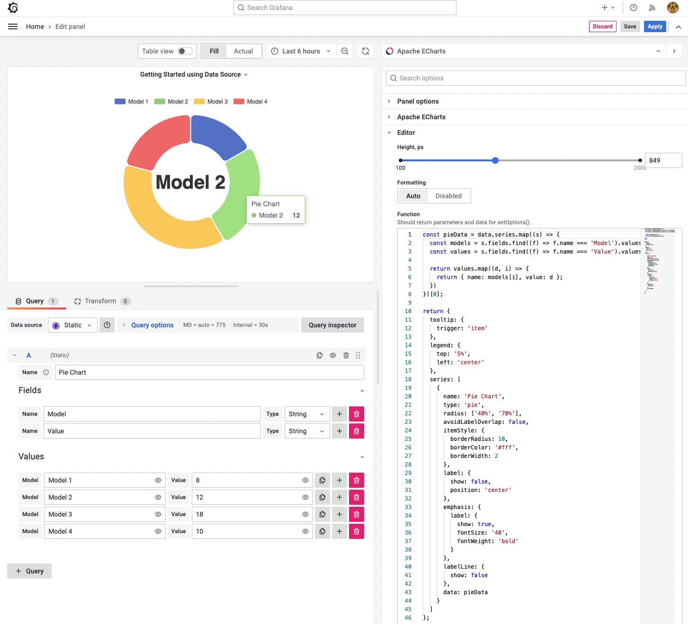

# Apache ECharts Panel 4.0.0

We released a major release of the Apache ECharts Panel 4.0.0 for Grafana. This version

- Introduced breaking changes with loading GeoJSON maps, which are disabled by default.
- Documentation and examples were updated and moved to https://docs.volkovlabs.io and https://echarts.volkovlabs.io.

<!--truncate-->

We are enthusiastic about the new release and will continue improving the panel introducing support for Annotations and custom themes in the upcoming versions.



## Getting Started

Apache ECharts visualization panel can be installed from the [Grafana Catalog](https://grafana.com/grafana/plugins/volkovlabs-echarts-panel/) or utilizing the Grafana command line tool. For the latter, use the following command:

```bash
grafana-cli plugins install volkovlabs-echarts-panel
```

## YouTube Tutorial

The Apache ECharts plugin is a visualization panel for Grafana that allows you to incorporate popular Apache ECharts libraries into your Grafana dashboard.

<iframe width="100%" height="500" src="https://www.youtube.com/embed/DxqCrBEmrQw" title="Apache Echarts panel for Grafana | How to create modern dashboards in Grafana | Echarts Tutorial" frameBorder="0" allow="accelerometer; autoplay; clipboard-write; encrypted-media; gyroscope; picture-in-picture" allowFullScreen></iframe>

## Release Notes

### Breaking changes

- World and USA GeoJSON maps are not loaded by default. Please select `JSON` in the Maps option.

### Features / Enhancements

- Update ECharts Examples on https://echarts.volkovlabs.io (#103)
- Add Calendar Examples on https://echarts.volkovlabs.io (#105)
- Update README and move Documentation to https://docs.volkovlabs.io (#107)

### Bug fixes

- Fix javascript code in documentation (#102)

## Feedback

We love to hear from you. There are various ways to get in touch with us:

- Ask a question, request a new feature, and file a bug with [GitHub issues](https://github.com/volkovlabs/volkovlabs-echarts-panel/issues/new/choose).
- Sponsor our open-source plugins for Grafana with [GitHub Sponsor](https://github.com/sponsors/VolkovLabs).
- Star the repository to show your support.
