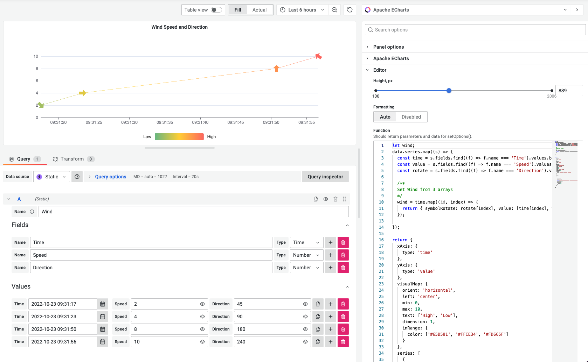

# Static Data Source 2.1.0

We released a new version of **Static Data Source 2.1.0**. In this version, we
- finished refactoring
- updated to the latest Grafana toolkit 9.3.2
- introduced new features for `Time`, `Number`, and `String` fields.

<!--truncate-->

The Static Data Source was initially developed and positioned to emulate data for testing and developing new plugins. Still, there is another compelling use case for storing data inside the dashboard, which we see utilized by the community.



## Getting Started

The Static Data Source can be installed from the [Grafana Catalog](https://grafana.com/grafana/plugins/marcusolsson-static-datasource/) or use the `grafana-cli` tool to install from the command line:

```bash
grafana-cli plugins install marcusolsson-static-datasource
```

## YouTube Tutorial

The Static Data Source is a plugin for Grafana that allows to store and emulate your data.

<iframe width="100%" height="500" src="https://www.youtube.com/embed/QOV8ECOUjWs" title="Static data source for Grafana | Mimic any data source | Tutorial and examples" frameBorder="0" allow="accelerometer; autoplay; clipboard-write; encrypted-media; gyroscope; picture-in-picture" allowFullScreen></iframe>

## Release Notes

### Breaking changes

Refactoring may introduce breaking changes. Please test before upgrading in Production.

### Features / Enhancements

- Update CI to upload signed artifacts (#23)
- Add the "Static data source for Grafana | Mimic any data source | Tutorial and examples" video in README (#23)
- Update to Grafana 9.3.2 (#24)
- Refactoring and improving Test Coverage for the data source (#25)
- Update Field and Values Editors to labels and fields structure (#27)
- Remove Frame Reducer to simplify code (#28)
- Refactoring frame, field utilities (#29)
- Add Date, Time Picker, Number, and Text Area Inputs (#30)
- Update Value Input component (#31)

## Feedback

We love to hear from you. There are various ways to get in touch with us:

- Ask a question, request a new feature, and file a bug with [GitHub issues](https://github.com/volkovlabs/volkovlabs-static-datasource/issues/new/choose).
- Sponsor our open-source plugins for Grafana with [GitHub Sponsor](https://github.com/sponsors/VolkovLabs).
- Star the repository to show your support.
