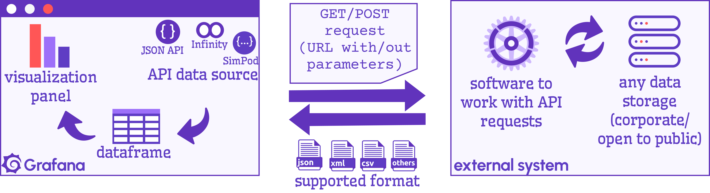
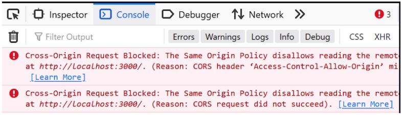

# JSON API Data sources in Grafana

Grafana is a visualization tool with all blows and whistles you can think of. Yet, by definition, Grafana never stands alone. Grafana **displays**, it does not generate, it does not store (with some exceptions, a.k.a. [Static data source, storage function](/plugins/volkovlabs-static-datasource)). It always has to interact with another artifact: the data storage, whatever that storage is. 

Access via API is one possible approach a visualization tool can use to connect to data storage. This article will share my analysis of the existing API Grafana data sources.

<!--truncate-->

## What is an API data source in Grafana

Let's start with the basics to ensure we are on the same page.

> **Data source** in Grafana is an interpreter between the data storage format and a Grafana data frame.

> **Grafana data frame** is a table-like data structure you can reference using column names while configuring your Grafana visualization panel or any other Grafana aspects. You can think of **Grafana data frame** as a data table within Grafana.

The abbreviation **API** (for **Application Programming Interface**) is an overused term in technology discussions. The definition of API is so vague you might think people talk about magic. If you are unfamiliar with API, you could feel lost and bewildered.

The reality is, however, not frightening at all. API, conceptually, is a mechanism allowing two systems to interact (I know, still mysterious). Regarding Grafana as a visualization tool, **API** is when a file is generated by another software (in most cases, it is an extract from a database) and then displayed on the Grafana dashboard. 

Simply put, a file gets created somewhere else. You give instructions to Grafana on where to get the file (usually a ``URL``) and how to read it (usually by specifying columns and/or data elements' names). 

All that above brings me to the API data source definition.

> **API data source** in Grafana is a plugin that downloads a file via provided link and then, following the given instructions, reads the file and converts it into a **Grafana data frame**.

Boom! That was your API 101 crash course. 

## What are the most popular API data sources in Grafana

I have them on my schema above. They are JSON API, Infinity, and SimPod. Let's crack them one by one. 

### [JSON API Data source](https://grafana.com/grafana/plugins/marcusolsson-json-datasource/)

Yeah, this is its name. Something more distinctive would make things easier. Like Arugula, a good name for a data source, why not. But no, we have two super-overused words combined. Brilliant. It surely does not help with Internet searches. Anyways.

#### Supported formats

JSON API data source works with one format, ``JSON``. So, the system you want to retrieve this file from must create a JSON file for you, with no exceptions. 

#### Access

If you are new to API, the good news is the topics of access and CORS restrictions could be omitted. I have to mention it in this article because Grafana does not explicitly notify you when an external system rejects your request due to CORS restrictions. Grafana will behave like nothing is happening, leaving you in limbo.

Open data sets, by definition, do not have CORS restrictions, which makes JSON API data source an excellent choice to work with them. Especially given that JSON API data source has fewer parameters and a straightforward interface. 

There are many open datasets available to everybody interested in their free data. To name a few: 
- [U.S. Bureau of Labor Statistics](https://www.bls.gov/),
- [American Economic Association](https://www.aeaweb.org/),
- [NASA Open Data Portal](https://data.nasa.gov/).

#### Author

Marcus Olsson has created the plugin. Now  Grafana Labs has taken over and fully maintains it.

### [Infinity API data source](https://grafana.com/grafana/plugins/yesoreyeram-infinity-datasource/)

The name is outstanding. It is unique, memorable, and has a good meaning.

#### Supported formats

I believe the name of this data source comes from the idea of supporting an unlimited number of exchange file formats. Let's create a data source that will work with every data structure possible, the author thought. That is my pure speculation. 

The supported formats are ``JSON``, ``CSV``, ``XML``, ``GraphQL``, ``HTML``, ``UQL``, ``RSS``, ``ATOM`` and some others.

#### Access

Like JSON API data source, Infinity can seamlessly work with open data sets (they have no CORS restrictions). In some cases, when CORS restrictions are on, Infinity can bypass them. And here you go, let's get more technical and dive an inch deep into Internet security. 

To better understand CORS, I start with

> ``Same-origin policy`` is a policy allowing to interact resources **ONLY** from the same domain, host and port.
For instance, **abc.com** can retrieve data from **abc.com/page1**, but is not permitted to access **anyotherdomain.com**.

> ``Cross Origin Resource Sharing (CORS)`` policy is more flexible. It was created to allow different domains to interact. 
If CORS restrictions are off, any domain is allowed to request data. If CORS restrictions are ON, only whitelisted domains are permitted. 

The Infinity data source might bypass that rule since CORS exists on the frontend layer, the layer of browsers. The Infinity data source can access other domains via the backend.

You can look for a rejection error in your browser's ``Console`` mode. Unfortunately, Grafana will not be explicit. Nothing will notify you about a CORS restrictions error.  

#### Author

Sriramajeyam Sugumaran has created this plugin. He maintains and supports it to this moment.

### [SimPod API data source](https://grafana.com/grafana/plugins/simpod-json-datasource/)

This API data source is for advanced users. This data source is tightly coupled with Grafana core functionality, like tags, variables, range filters, etc. For all that to work, SimPod expects a specific data format. That means you will have to create your own API server to interact with external resources. That server will retrieve data in the original layout and convert it into SimPod format.

#### Author

Šimon Podlipský has created this plugin. He maintains and supports it to this moment.

## Summary schema

The schema below summarizes the comparative analysis. It shows four data sources, JSON API, Infinity, Simpod, and all other specific data sources are combined in the ``specific data source`` category (like InfluxDB data source, MS SQL data source, etc.)

Colors highlight scenarios for each data source.

**Red** highlights the JSON API data source scenario. It shows that this data source is awesome for beginners, works in no CORS restrictions environment, supports only one format (JSON), and is great for interacting with open datasets. 

**Yellow** highlights the Infinity data source scenario, showing that Infinity can work with CORS and no CORS environments (since it could access the data domains from ``frontend`` and ``backend``), supports various formats and is great to work with both open and corporate datasets. 

Simpod in **green** color adds extra functionality on top of the core Grafana dashboard for the price of your own API server to provide a specific data format (I called it ``JSON+simpod`` format in my schema).

In **purple** color, the schema has all corporate scenarios where ``direct`` access to the database is permitted. 

## Our YouTube channel's relevant videos

I go over the schema in the following video "JSON Data Sources for Grafana".

<iframe width="100%" height="500" src="https://www.youtube.com/embed/h1Mx4UvtKGY" title="JSON Data Sources for Grafana | JSON API, Infinity, Simpod compared" frameBorder="0" allow="accelerometer; autoplay; clipboard-write; encrypted-media; gyroscope; picture-in-picture" allowFullScreen></iframe>

Watch the other video to get a detailed tutorial on displaying data on your Grafana dashboard using JSON API and Infinity data sources.

<iframe width="100%" height="500" src="https://www.youtube.com/embed/B4Uj1n4Cr88" title="JSON Data Sources for Grafana | JSON API, Infinity, Simpod compared" frameBorder="0" allow="accelerometer; autoplay; clipboard-write; encrypted-media; gyroscope; picture-in-picture" allowFullScreen></iframe>

Any feedback and comments are welcome. Feel free to challenge us with your questions. It helps us to stay sharp!
