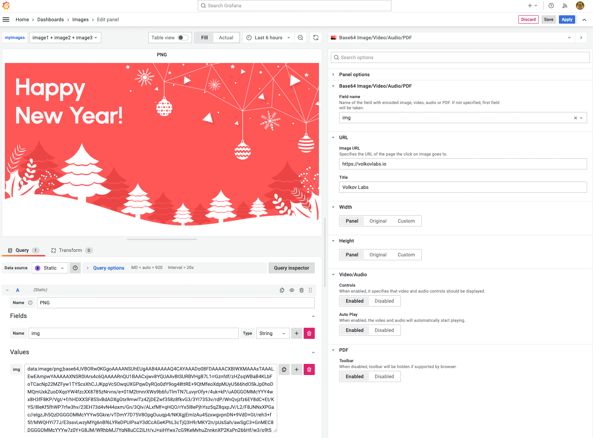

# Base64 Image/Video/Audio/PDF Panel 3.4.0

We released a new version of Base64 Image/Video/Audio/PDF Panel 3.4.0. In this maintenance version

- Updated to the latest Grafana toolkit 9.3.2.
- Updated README and [documentation](/plugins/volkovlabs-image-panel) to explain how to use the panel with data sources and supported formats.
- "New Year" edition.

<!--truncate-->



## Getting Started

Base64 Image/Video/Audio/PDF visualization panel can be installed from the [Grafana Catalog](https://grafana.com/grafana/plugins/volkovlabs-image-panel/) or utilizing the Grafana command line tool. For the latter, use the following command:

```bash
grafana-cli plugins install volkovlabs-image-panel
```

## YouTube Tutorial

The Base64 Image/Video/Audio/PDF visualization panel is a plugin for Grafana that displays Base64 encoded files in PNG, JPG, GIF, MP4, WEBM, MP3, OGG, and PDF formats.

<iframe width="100%" height="500" src="https://www.youtube.com/embed/1_bgLSehjhg" title="Base64 Image/PDF panel" frameBorder="0" allow="accelerometer; autoplay; clipboard-write; encrypted-media; gyroscope; picture-in-picture" allowFullScreen></iframe>

## Release Notes

### Features / Enhancements

- Update to Grafana 9.3.2 (#60)
- Add Documentation links (#61)
- Update README and documentation (#62)

## Feedback

We love to hear from you. There are various ways to get in touch with us:

- Ask a question, request a new feature, and file a bug with [GitHub issues](https://github.com/volkovlabs/volkovlabs-image-panel/issues/new/choose).
- Sponsor our open-source plugins for Grafana with [GitHub Sponsor](https://github.com/sponsors/VolkovLabs).
- Star the repository to show your support.
