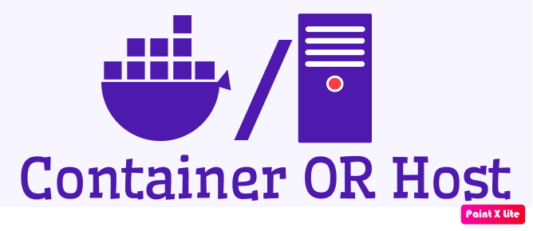
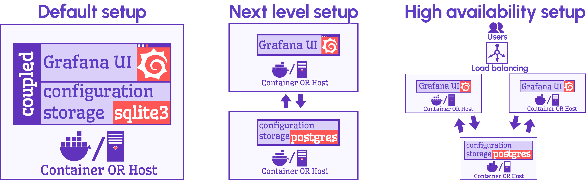
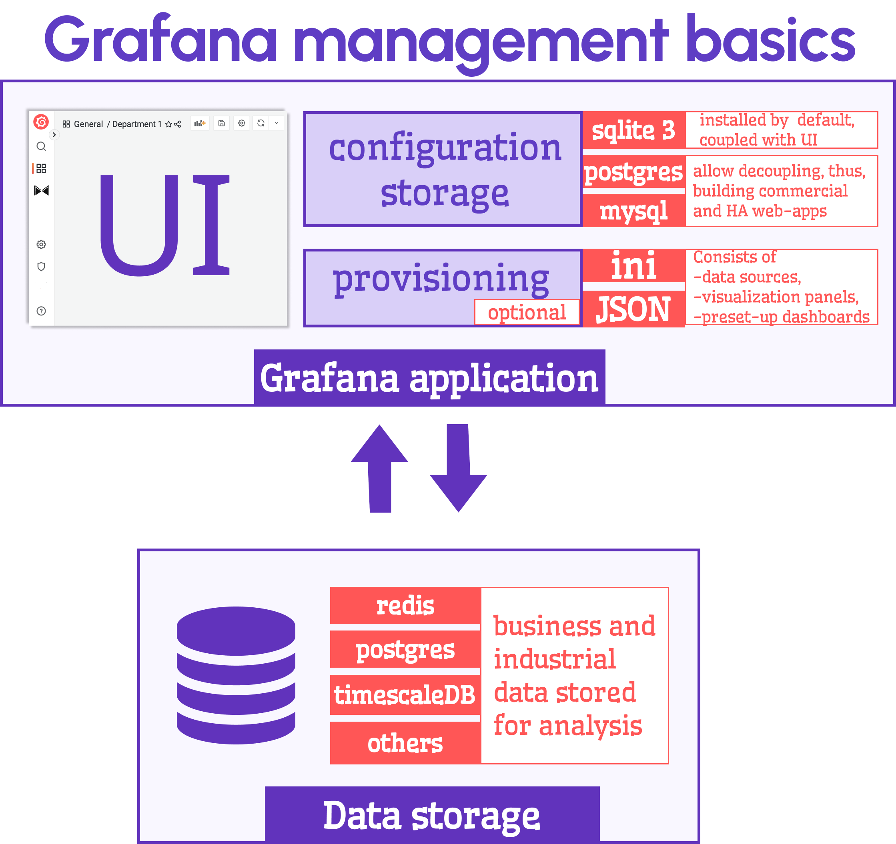

# PostgreSQL in Grafana

You landed at the right article if you wonder what database to choose for your commercial Grafana-based web application. I will share my thoughts on when it should be PostgreSQL, and you can decide if your use case is any close.

<!--truncate-->

Let me start with the three different Grafana setups. In any setup, Grafana can be installed directly on the host (computer) or in a docker container. That's why on the diagram below, every rectangle representing Grafana has the docker slash host symbol. 

## Default setup

You get the **default setup**  when you [download Grafana](https://grafana.com/grafana/download?pg=get&plcmt=selfmanaged-box1-cta1) and follow the simple installation steps.

*Grafana configuration* is a set of parameters describing its dashboards: data sources, visualization panels, variables, permissions, etcetera. *Grafana configuration* is stored in a database. In the **default setup** Grafana is bundled with the `sqlite3` database.

### SQLite database

SQLite is designed explicitly for small applications and is widely employed in myriads of applications across the globe. The database is meant to be coupled with an application, ensuring high reliability and efficiency. 

The database is so tiny and fast that some people do not even realize it exists along with their favorite applications on the phone or computer.

The code of SQLite is open for anyone to use for any purpose. 

The **default setup** (Grafana plus `sqlite3`) suits beginners well since it eliminates the maintenance needs allowing them to start exploring Grafana instantly, literally in minutes after they learned about Grafana's existence. 

#### Skills level required for default setup

The skill level required for this setup is relatively minimal. An inquisitive beginner-to-intermediate level developer or analyst can tackle the task with ease.

## Next Level setup

The **next level** setup is the lowest level you must be on for any commercial and industrial applications. On that setup, the Grafana UI and the configuration storage (which is *not* the same as application data storage) are separated and dwell on two segregated containers and/or hosts.
When Grafana users make any changes (for instance, add data sources and visualizations), they go into a separate entity, namely, configuration storage. 

On the **next level**, you can choose between two other than ``SQLite`` databases: `PostgreSQL`and `MySQL`.

The segregated setup (the **next level** setup):
- Allows to connect many Grafana UI to the same configuration storage. Therefore, to have a matching UI experience across all of Grafana UI.
- Requires to maintain only one configuration database instance, regardless of the Grafana UI number.
- Permits employing _provisioning_.

### Provisioning

**Provisioning** is a mechanism to push dashbaords configuration via ``ini`` and ``JSON`` files into Grafana UI. 
This mechanism is a simplified way to create applications with embedded/preset data sources, plugins, and dashboards. Users cannot introduce any changes to provisioned modifications. They see them as core functionality. 

#### Skill level required for the next level setup

Your best bet is someone who knows Grafana deeply and is capable of following all changes from one version to another. 
The applications on that level are light and functional. The Grafana architecture allows to solve any challenging problems as long as developers are willing to think out of the box and do not tend to stay on the paved trail. 

## High availability setup
One article is not enough to describe what is happening on this level.  

#### Skill level required for HA setup 

You obviously need a whole team of tech pros to support the web application with high upstream/downstream traffic and unstoppable 24/7 user requests.   

