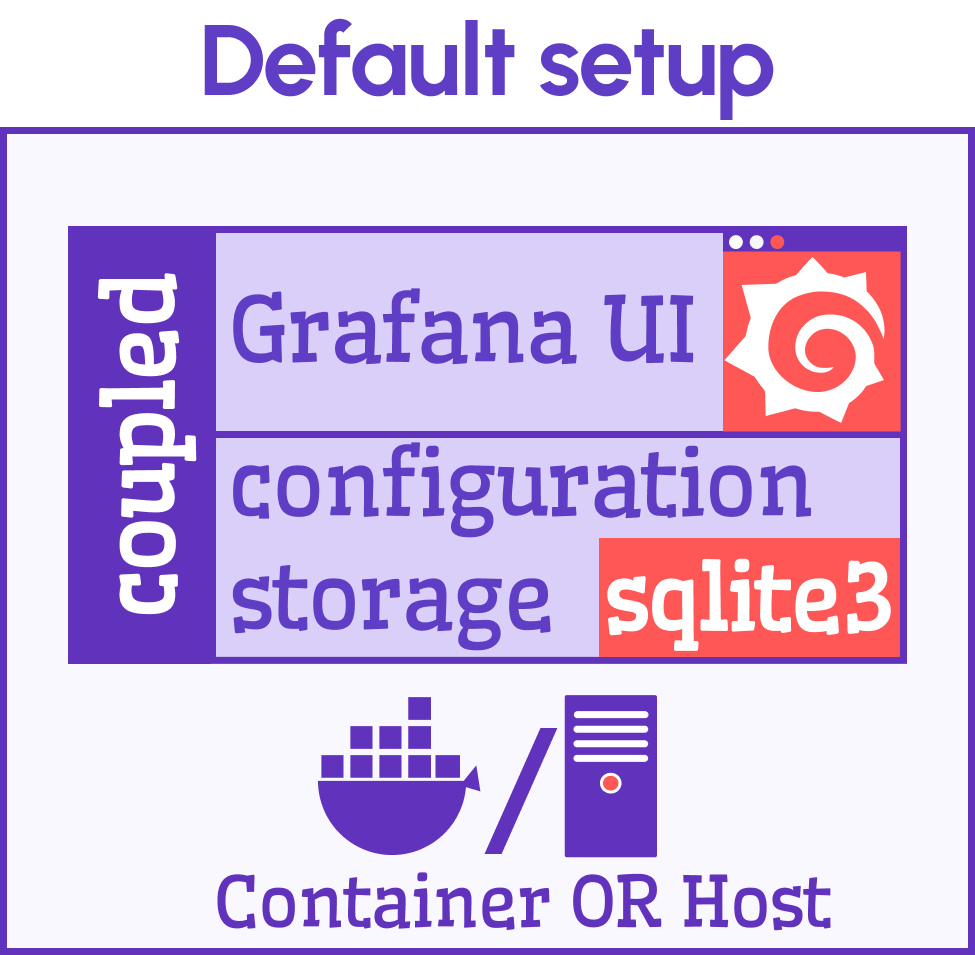
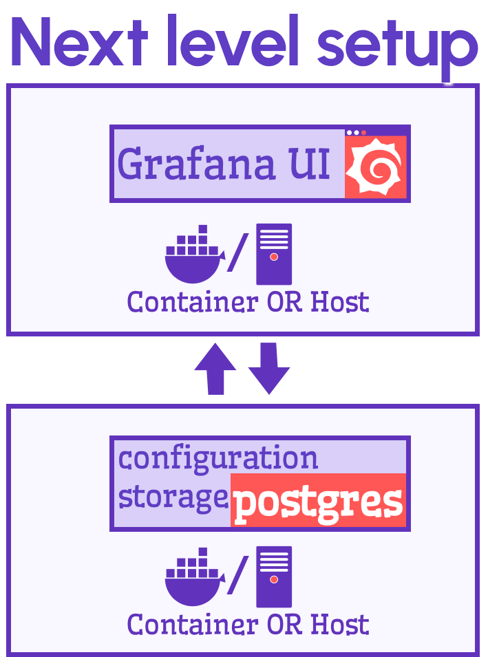
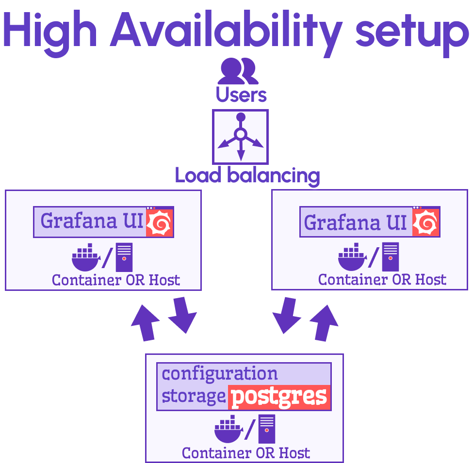

# From default Grafana setup to real deal

I did not find much-organized information about Grafana configuration from the management point of view. There is this famous **default setup**, but it is not clear what its limits are. Also, for those who would want to take the next step to an actual application, what direction should it be, or in other words, what should be modified in the default Grafana installation package to convert it into real deal.

<!--truncate-->

This article consists of the notes I took during my research. I share them to save the reader's time and effort.

In any setup, Grafana can be installed directly on the host (computer) or in a docker container. That's why on the diagram below, every rectangle representing Grafana has the docker slash host symbol. 

Let's review every level and who can benefit from each.

## Default setup

You get the default setup  when you [download Grafana](https://grafana.com/grafana/download) and follow the simple installation steps.

Grafana configuration is a set of parameters describing:
- dashboards,
- data sources,
- installed plugins,
- variables,
- permissions, etc.

Grafana configuration is stored in a database. In the default setup Grafana is bundled with the `sqlite3` database.

### Provisioning

Provisioning is a mechanism to push dashboards and data source configuration using `JSON` files into Grafana UI. This mechanism is a simplified way to create applications with embedded/preset data sources, plugins, and dashboards. Users cannot introduce any changes to provisioned modifications. They see them as core functionality. 

### SQLite database

SQLite is designed explicitly for small applications and is widely employed in myriads of applications across the globe. The database is meant to be coupled with an application, ensuring high reliability and efficiency.

The database is so tiny and fast that some people do not even realize it exists side by side with their favorite applications on the phone or computer. The code of SQLite is open for anyone to use for any purpose.

The default setup (Grafana plus `sqlite3`) suits beginners well since it eliminates the maintenance needs allowing them to start exploring Grafana instantly, literally in minutes after they learned about Grafana's existence.

We discussed how to update Grafana environment variables to use PostgresSQL database for configuration in our recent video.

<iframe width="100%" height="500" src="https://www.youtube.com/embed/SbjIWnrMIgk" title="Ultimate storage partner for Grafana | PostgreSQL with Timescale" frameBorder="0" allow="accelerometer; autoplay; clipboard-write; encrypted-media; gyroscope; picture-in-picture" allowFullScreen></iframe>

### Skills level

The skill level required for this setup is relatively minimal. An inquisitive beginner-to-intermediate developer or analyst can tackle the task with ease.

## Next Level setup

The next level setup is the lowest level you must be on for any commercial and industrial applications.

On that setup, the Grafana UI and the configuration storage (which is NOT the same as application data storage) are separated and dwell in two segregated containers and/or hosts.
When Grafana users make any changes (for instance, adding data sources and visualizations), these changes go into a separate entity, namely, configuration storage.

On the next level, you can choose between two databases: `PostgreSQL` and `MySQL`.

The segregated setup (the next level setup):
- Allows to connect many Grafana UI to the same configuration storage. Therefore, to have a matching UI experience across all of Grafana UI.
- Requires to maintain only one configuration database instance, regardless of the Grafana UI number.
- Permits employing provisioning.

### Skill level

Your best bet is someone who knows Grafana deeply and is capable of following changes from one version to another. 
The applications on that level are light and functional. The Grafana architecture allows to solve any challenging problems as long as developers are willing to think out of the box and do not tend to stay on the paved trail. 

## High Availability (HA) setup

Logically, this architecture should have at least two separate Grafana UI.

It is everything what the next level is, plus a load balancer. A load balancer will redirect the traffic between multiple Grafana UI depends on the load or other parameters. 

### Skill level

It would be best to have a whole team of tech pros to support the web application with high upstream/downstream traffic and unstoppable 24/7 user requests.   

Any feedback and comments are welcome. Feel free to challenge us with your questions. It helps us to stay sharp!
