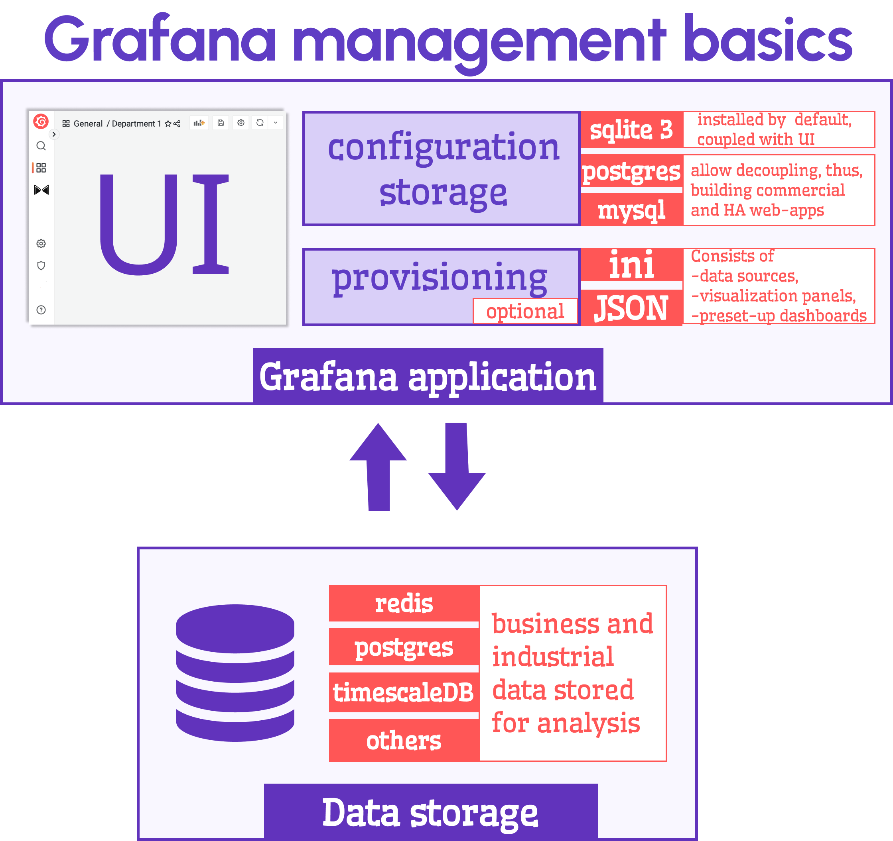

# PostgreSQL in Grafana

You landed at the right article if you wonder what database to choose for your commercial Grafana-based web application. I will share my thoughts on when it should be PostgreSQL, and you can decide if your use case is any close.

<!--truncate-->

