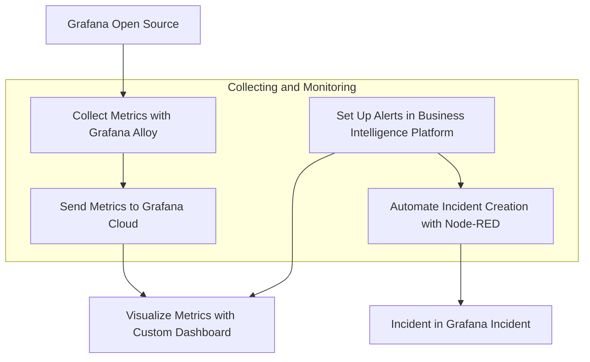

import BlogPost from "@theme/BlogPost";
import Code from "@theme/Code";
import Feedback from "@site/big/_feedback.mdx";
import GettingStarted from "@site/big/_getting_started.mdx";
import Image from "@theme/Image";
import Shorts from "@theme/Shorts";
import Youtube from "@theme/Youtube";

# Collecting Grafana OSS Metrics with Grafana Alloy and Building Alerts in a Business Intelligence Platform

Today, we are excited to walk you through a comprehensive setup for collecting Grafana Open Source Software (OSS) metrics using Grafana Alloy, sending them to Grafana Cloud, and creating alert rules in our Business Intelligence platform. Additionally, we'll integrate incident creation in Grafana Incident using a Node-RED workflow. This tutorial is based on a specific Grafana dashboard configuration I've been working on, which you can find in the [Business Intelligence GitHub repository](https://github.com/volkovlabs/business-intelligence).

## Overview of the Setup

Our goal is to monitor Grafana OSS metrics effectively and ensure timely incident management. Here's the high-level workflow we'll follow:

1. **Collect Metrics with Grafana Alloy**: Use [Grafana Alloy](https://grafana.com/docs/alloy/latest/) to scrape metrics from Grafana OSS.
2. **Send Metrics to Grafana Cloud**: Configure Alloy to forward these metrics to Grafana Cloud for centralized monitoring.
3. **Visualize Metrics with a Custom Dashboard**: Utilize a [pre-configured dashboard](https://github.com/VolkovLabs/business-intelligence/blob/main/grafana/grafana-metrics.json) to visualize key metrics.
4. **Set Up Alerts in [Business Intelligence Platform](/big)**: Create alert rules based on the dashboard metrics to detect anomalies or thresholds being breached.
5. **Automate Incident Creation with Node-RED**: Use a [Node-RED workflow](https://github.com/VolkovLabs/business-intelligence/blob/main/node-red/grafana-incident.json) to automatically create incidents in [Grafana Incident](https://grafana.com/products/cloud/incident/) when alerts are triggered.



Let’s dive into each step in detail.

## Collecting Metrics with Grafana Alloy

Grafana Alloy is a powerful, vendor-agnostic telemetry collector that can scrape metrics from various sources, including Grafana OSS. Here's how to set it up:

1. **Install Grafana Alloy**: Follow the official documentation to install Alloy on your server or environment where Grafana OSS is running.
2. **Configure Alloy for Grafana OSS**: Create a configuration file for Alloy to scrape metrics from Grafana's Prometheus endpoint. A basic configuration might look like this:

```json
prometheus.scrape "grafana" {
  targets = [
    { __address__ = "grafana:3000" },
  ]

  scrape_interval = "15s"
  forward_to = [prometheus.remote_write.grafana_cloud.receiver]
}

prometheus.remote_write "grafana_cloud" {
  endpoint {
    url = "https://prometheus-prod-01-grafana-cloud.grafana.net/api/prom/push"
    basic_auth {
      username = "your_username"
      password = "your_api_key"
    }
  }
}
```

This configuration tells Alloy to scrape metrics from Grafana running on port 3000 and forward them to Grafana Cloud.

3. **Run Alloy**: [Start the Alloy service](https://grafana.com/docs/alloy/latest/set-up/run/) with your configuration file to begin collecting metrics.

## Sending Metrics to Grafana Cloud

Once Alloy is configured, it will send the scraped metrics to Grafana Cloud. Ensure you have a Grafana Cloud account and an API key for authentication. The `prometheus.remote_write` component in the Alloy configuration handles this seamlessly.

Verify in Grafana Cloud that metrics are being received by navigating to the Prometheus data source and querying for Grafana metrics like `grafana_process_cpu_seconds_total`.

<Image
  title="Graph in the Grafana Alloy display Prometheus Scraper and Docker Discovery pipelines."
  src="/img/blog/2025-07-15-grafana-incident/grafana-alloy.png"
/>

## Visualizing Metrics with a Custom Dashboard

We have created a comprehensive dashboard for Grafana metrics, which you can find in the [Business Intelligence repository](https://github.com/VolkovLabs/business-intelligence). This dashboard includes panels for:

- **API, Web, Proxy Requests**: Tracks request rates for different Grafana components.
- **HTTP Requests**: Monitors the rate of HTTP requests by handler and instance.
- **Dashboard Get/Search Latency**: Measures the time taken for dashboard operations.
- **CPU and Memory Usage**: Displays resource consumption metrics.
- **In-Flight HTTP Requests and Open File Descriptors**: Provides insights into system load and resource usage.

To use this dashboard, import the JSON file into your Grafana Cloud. The dashboard uses variables like `instance` and `job` for dynamic filtering, ensuring you can monitor multiple Grafana instances effectively.

<Image
  title="Grafana Dashboard displays API, Web, Proxy, HTTP Requests and Dashboard Get/Search Latency panels."
  src="/img/blog/2025-07-15-grafana-incident/grafana-dashboard.png"
/>

## Setting Up Alerts in Business Intelligence Platform

At Volkov Labs, we’ve developed a Business Intelligence platform that integrates seamlessly with Grafana to provide advanced alerting and reporting capabilities. Using the metrics visualized in the dashboard, we’ll create alert rules to monitor critical thresholds. Here’s how to set up alerts based on the dashboard panels:

1. **Access the Business Studio**: Configured to [Business Engine](/big/engine) connected to the Grafana Cloud.
2. **Create Alert Rules**: Based on the Grafana Metrics dashboard, define alert rules for key metrics to monitor.
3. **Configure Actions**: Set up notifications to be sent to Grafana Incident when an alert is triggered.

These alert rules correspond to the thresholds defined in the dashboard’s panels for color changes (green to orange to red), ensuring consistency between visualization and alerting.

<Image
  title="Alert Rules based on the Grafana Metrics dashboard configured in Business Studio."
  src="/img/blog/2025-07-15-grafana-incident/grafana-alerts.png"
/>

## Automating Incident Creation with Node-RED Workflow

To complete the monitoring loop, we’ll automate incident creation in Grafana Incident using a Node-RED workflow. Node-RED is a flow-based development tool for visual programming, and it’s perfect for integrating alerts with incident management.

1. **Set Up Node-RED**: [Install Node-RED](https://nodered.org/docs/getting-started/) on a server or use a cloud-hosted instance. Ensure it has access to your Grafana instance and Grafana Cloud API.
2. **Create a Workflow for Alerts**: Build a [flow in Node-RED](https://github.com/VolkovLabs/business-intelligence/blob/main/node-red/grafana-incident.json) to listen for alerts from the Business Intelligence platform and create incidents in Grafana Incident.

<Image
  title="Alert Rules based on the Grafana Metrics dashboard configured in Business Studio."
  src="/img/blog/2025-07-15-grafana-incident/grafana-incident-flow.png"
/>

3. **Configure Grafana Incident API**: Use your Grafana Cloud credentials to authenticate API calls from Node-RED. Ensure the API endpoint for incident creation is correctly set in the HTTP Request node.
4. **Test the Workflow**: Trigger a test alert from the Business Intelligence platform and verify that an incident is created in Grafana Incident with the correct details.

<Image
  title="Grafana Incident Action configured in Business Studio."
  src="/img/blog/2025-07-15-grafana-incident/action-settings.png"
/>

This workflow is part of Business Intelligence repository, and you can find the Node-RED flow configuration alongside other resources for this setup.

## Conclusion

By following these steps, you can create a robust monitoring system for Grafana OSS using Grafana Alloy and Grafana Cloud, visualize critical metrics with a custom dashboard, set up proactive alerts in the Business Intelligence platform, and automate incident management with Node-RED and Grafana Incident.

<Image
  title="Declared Incident in Grafana Incidents using webhook."
  src="/img/blog/2025-07-15-grafana-incident/incident-details.png"
/>

This end-to-end solution ensures that any issues with your Grafana instances are quickly identified and addressed, minimizing downtime and maintaining operational efficiency.

Stay tuned for more insights and tutorials on leveraging Grafana for powerful data visualization and monitoring!

<GettingStarted />

<Feedback />
