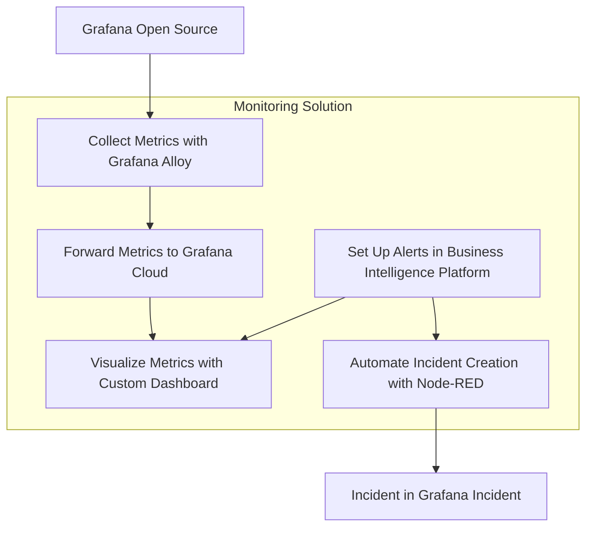

import BlogPost from "@theme/BlogPost";
import Code from "@theme/Code";
import Feedback from "@site/big/_feedback.mdx";
import GettingStarted from "@site/big/_getting_started.mdx";
import Image from "@theme/Image";
import Shorts from "@theme/Shorts";
import Youtube from "@theme/Youtube";

# Monitoring Grafana OSS Metrics with Grafana Alloy and Automating Alerts in a Business Intelligence Platform

In this tutorial, we’ll walk you through a comprehensive setup for monitoring Grafana Open Source Software (OSS) metrics using Grafana Alloy, forwarding them to Grafana Cloud, and creating actionable alerts within our Business Intelligence platform. Additionally, we’ll demonstrate how to automate incident creation in Grafana Incident using a Node-RED workflow.

This guide is based on a specific Grafana dashboard configuration available in the [Business Intelligence GitHub repository](https://github.com/volkovlabs/business-intelligence). Whether you're managing a single Grafana instance or a distributed environment, this end-to-end solution will help you ensure operational efficiency and rapid incident response.

## Overview of the Monitoring Workflow

Our objective is to establish a robust system for monitoring Grafana OSS metrics, enabling proactive incident management, and validating data through an external platform. Here’s the high-level workflow we’ll implement:

1. **Collect Metrics with Grafana Alloy**: Scrape metrics from Grafana OSS using [Grafana Alloy](https://grafana.com/docs/alloy/latest/).
2. **Forward Metrics to Grafana Cloud**: Configure Alloy to send metrics to Grafana Cloud for centralized storage and analysis.
3. **Visualize Metrics with a Custom Dashboard**: Use a [pre-configured dashboard](https://github.com/VolkovLabs/business-intelligence/blob/main/grafana/grafana-metrics.json) to monitor Grafana key performance indicators.
4. **Create Alerts in a Business Intelligence Platform**: Set up alert rules based on dashboard metrics to detect anomalies or threshold breaches.
5. **Automate Incident Creation with Node-RED**: Implement a [Node-RED workflow](https://github.com/VolkovLabs/business-intelligence/blob/main/node-red/grafana-incident.json) to automatically create incidents in [Grafana Incident](https://grafana.com/products/cloud/incident/) when alerts are triggered.



Let’s explore each step in detail to build this powerful monitoring solution.

## Collecting Metrics with Grafana Alloy

Grafana Alloy is a versatile, vendor-agnostic telemetry collector designed to scrape metrics from various sources, including Grafana OSS. Follow these steps to set it up:

1. **Install Grafana Alloy**: Refer to the [official documentation](https://grafana.com/docs/alloy/latest/set-up/) to install Alloy on the server or environment hosting your Grafana OSS instance.
2. **Configure Alloy for Grafana OSS**: Create a configuration file to scrape metrics from Grafana’s Prometheus endpoint (typically exposed on port 3000). Below is a sample configuration:

```json
prometheus.scrape "grafana" {
  targets = [
    { __address__ = "grafana:3000" },
  ]
  scrape_interval = "15s"
  forward_to = [prometheus.remote_write.grafana_cloud.receiver]
}

prometheus.remote_write "grafana_cloud" {
  endpoint {
    url = "https://prometheus-prod-01-grafana-cloud.grafana.net/api/prom/push"
    basic_auth {
      username = "your_username"
      password = "your_api_key"
    }
  }
}
```

This configuration directs Alloy to collect metrics from Grafana every 15 seconds and forward them to Grafana Cloud.

3. **Run Grafana Alloy**: Start the Alloy service with your configuration file as outlined in the [Alloy setup guide](https://grafana.com/docs/alloy/latest/set-up/run/).

## Sending Metrics to Grafana Cloud

With Alloy configured, metrics are automatically forwarded to Grafana Cloud. Ensure you have a Grafana Cloud account and an API key for authentication, as specified in the `prometheus.remote_write` component of the Alloy configuration.

<Image
  title="Grafana Alloy interface displaying Prometheus Scraper and Docker Discovery pipelines."
  src="/img/blog/2025-07-15-grafana-incident/grafana-alloy.png"
/>

To verify that metrics are being received, navigate to the Prometheus data source in Grafana Cloud and query for Grafana-specific metrics, such as `grafana_process_cpu_seconds_total`.

## Visualizing Metrics with a Custom Dashboard

We’ve developed a comprehensive dashboard for Grafana OSS metrics, available in the [Business Intelligence repository](https://github.com/VolkovLabs/business-intelligence). This dashboard features panels for:

- **API, Web, and Proxy Requests**: Tracks request rates across Grafana components.
- **HTTP Requests**: Monitors request rates by handler and instance.
- **Dashboard Get/Search Latency**: Measures response times for dashboard operations.
- **CPU and Memory Usage**: Displays resource consumption metrics.
- **In-Flight HTTP Requests and Open File Descriptors**: Provides insights into system load and resource utilization.

<Image
  title="Grafana Dashboard showing panels for API, Web, Proxy, HTTP Requests, and Dashboard Latency."
  src="/img/blog/2025-07-15-grafana-incident/grafana-dashboard.png"
/>

To implement this dashboard, import the [JSON file](https://github.com/VolkovLabs/business-intelligence/blob/main/grafana/grafana-metrics.json) into Grafana Cloud. It includes dynamic variables like `instance` and `job` for filtering, enabling effective monitoring across multiple Grafana instances.

## Setting Up Alerts in a Business Intelligence Platform

Our Business Intelligence platform integrates seamlessly with Grafana to provide advanced alerting capabilities. Using the metrics visualized in the dashboard, you can create alert rules to monitor critical thresholds. Here’s how:

1. **Access Business Studio**: Connect to the [Business Engine](/big/engine) linked to your Grafana Cloud instance.
2. **Define Alert Rules**: In Business Studio, create rules based on the Grafana Metrics dashboard to monitor key performance indicators.
3. **Configure Notification Actions**: Set up notifications to trigger incidents in Grafana Incident when an alert condition is met.

<Image
  title="Alert Rules configured in Business Studio based on Grafana Metrics dashboard."
  src="/img/blog/2025-07-15-grafana-incident/grafana-alerts.png"
/>

These alert rules align with the color-coded thresholds (green, orange, red) in the dashboard panels, ensuring consistency between visualization and alerting logic.

<Image
  title="Thresholds defined in panel options to set allowed metric ranges."
  src="/img/blog/2025-07-15-grafana-incident/alert-thresholds.png"
/>

:::info Automatic Thresholds
In the upcoming version 3.7.0, thresholds will be determined automatically for even greater ease of use.
:::

## Automating Incident Creation with Node-RED

To streamline incident management, we’ll automate the creation of incidents in Grafana Incident using a Node-RED workflow. Node-RED is a flow-based development tool ideal for integrating alerts with incident management systems.

1. **Install Node-RED**: Follow the [installation guide](https://nodered.org/docs/getting-started/) to set up Node-RED on a server or use a cloud-hosted instance. Ensure it can access your Grafana instance and Grafana Cloud API.
2. **Build a Workflow for Alerts**: Create a [flow in Node-RED](https://github.com/VolkovLabs/business-intelligence/blob/main/node-red/grafana-incident.json) to listen for alerts from the Business Intelligence platform and create corresponding incidents in Grafana Incident.

<Image
  title="Node-RED flow for automating incident creation based on triggered alerts."
  src="/img/blog/2025-07-15-grafana-incident/grafana-incident-flow.png"
/>

3. **Configure Grafana Incident API**: Use Grafana Cloud credentials to authenticate API calls from Node-RED, ensuring the correct endpoint for incident creation is specified in the HTTP Request node.
4. **Test the Workflow**: Trigger a test alert from the Business Intelligence platform and confirm that an incident is created in Grafana Incident with accurate details.

<Image
  title="Grafana Incident Action settings configured in Business Studio."
  src="/img/blog/2025-07-15-grafana-incident/action-settings.png"
/>

This workflow is included in the Business Intelligence repository alongside other resources for this setup.

## Enhancing Monitoring with an Business Intelligence Platform

While Grafana Cloud offers robust monitoring capabilities, integrating a Business Intelligence (BI) platform provides an additional layer of validation and oversight. This multi-layered approach enhances data integrity and monitoring reliability. Here’s how to implement it:

1. **Configure Independent Alerts**: Set up alerts in the BI platform to detect anomalies not captured by Grafana Cloud.
2. **Establish a Feedback Loop to Grafana Incident**: Use APIs or Node-RED workflows to integrate the BI platform with Grafana Incident, ensuring issues detected outside Grafana Cloud are escalated automatically for unified incident management.

<Image
  title="Declared Incident in Grafana Incident triggered via webhook."
  src="/img/blog/2025-07-15-grafana-incident/incident-details.png"
/>

By incorporating a BI platform, you create a resilient monitoring strategy that minimizes blind spots and supports informed decision-making. This is especially valuable for organizations managing complex, distributed systems.

## Conclusion

This guide has equipped you with a powerful end-to-end monitoring system for Grafana OSS. By leveraging Grafana Alloy and Grafana Cloud, you’ve enabled seamless metric collection and visualization through a custom dashboard. Proactive alerts in the Business Intelligence platform, combined with automated incident creation via Node-RED and Grafana Incident, ensure rapid detection and response to issues.

:::info BI Platform
Integrating a BI platform adds a critical layer of data validation and cross-source monitoring, enhancing reliability and reducing operational risks.
:::

This solution minimizes downtime, improves operational efficiency, and provides a scalable framework for monitoring complex environments. Whether managing a single Grafana instance or a distributed system, these tools and workflows enable you to stay ahead of potential issues and maintain optimal performance.

<GettingStarted />

<Feedback />
