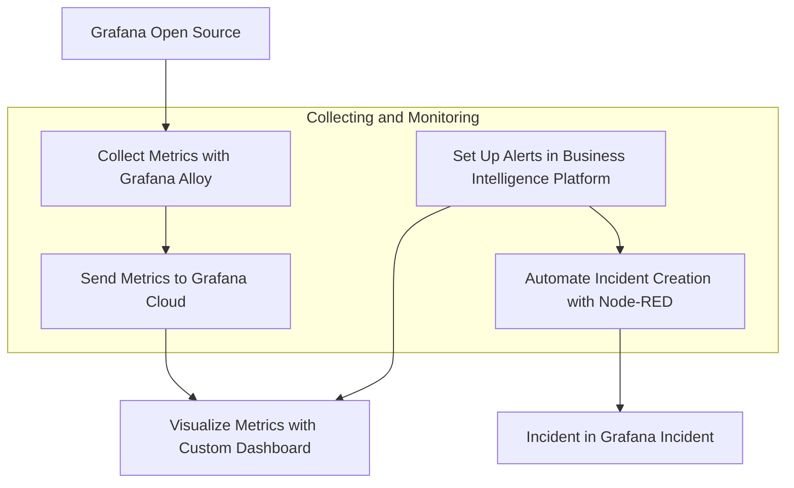

import BlogPost from "@theme/BlogPost";
import Code from "@theme/Code";
import Feedback from "@site/big/_feedback.mdx";
import GettingStarted from "@site/big/_getting_started.mdx";
import Image from "@theme/Image";
import Shorts from "@theme/Shorts";
import Youtube from "@theme/Youtube";

# Collecting Grafana OSS Metrics with Grafana Alloy and Building Alerts in a Business Intelligence Platform

Today, we're thrilled to guide you through a comprehensive setup for collecting Grafana Open Source Software (OSS) metrics using Grafana Alloy, sending them to Grafana Cloud, and creating alert rules within our Business Intelligence platform. We'll also explore how to automate incident creation in Grafana Incident using a Node-RED workflow and enhance monitoring by integrating an external platform.

This tutorial is based on a specific Grafana dashboard configuration we've been working on, available in the [Business Intelligence GitHub repository](https://github.com/volkovlabs/business-intelligence).

## Overview of the Setup

Our goal is to build a robust system to monitor Grafana OSS metrics, ensure timely incident management, and add an extra layer of validation through external platform. Here's the high-level workflow we'll follow:

1. **Collect Metrics with Grafana Alloy**: Use [Grafana Alloy](https://grafana.com/docs/alloy/latest/) to scrape metrics from Grafana OSS.
2. **Send Metrics to Grafana Cloud**: Configure Alloy to forward these metrics to Grafana Cloud for centralized monitoring.
3. **Visualize Metrics with a Custom Dashboard**: Leverage a [pre-configured dashboard](https://github.com/VolkovLabs/business-intelligence/blob/main/grafana/grafana-metrics.json) to visualize key metrics.
4. **Set Up Alerts in [Business Intelligence Platform](/big)**: Create alert rules based on dashboard metrics to detect anomalies or threshold breaches.
5. **Automate Incident Creation with Node-RED**: Use a [Node-RED workflow](https://github.com/VolkovLabs/business-intelligence/blob/main/node-red/grafana-incident.json) to automatically create incidents in [Grafana Incident](https://grafana.com/products/cloud/incident/) when alerts are triggered.
6. **Enhance Monitoring with an External Business Intelligence Platform**: Verify data from various sources to add an additional layer of monitoring and ensure data integrity.



Let’s dive into each step in detail.

## Collecting Metrics with Grafana Alloy

Grafana Alloy is a versatile, vendor-agnostic telemetry collector that scrapes metrics from various sources, including Grafana OSS. Here's how to set it up:

1. **Install Grafana Alloy**: Follow the [official documentation](https://grafana.com/docs/alloy/latest/set-up/) to install Alloy on the server or environment hosting Grafana OSS.
2. **Configure Alloy for Grafana OSS**: Create a configuration file to scrape metrics from Grafana's Prometheus endpoint. A sample configuration might look like this:

```json
prometheus.scrape "grafana" {
  targets = [
    { __address__ = "grafana:3000" },
  ]

  scrape_interval = "15s"
  forward_to = [prometheus.remote_write.grafana_cloud.receiver]
}

prometheus.remote_write "grafana_cloud" {
  endpoint {
    url = "https://prometheus-prod-01-grafana-cloud.grafana.net/api/prom/push"
    basic_auth {
      username = "your_username"
      password = "your_api_key"
    }
  }
}
```

This configuration instructs Alloy to scrape metrics from Grafana on port 3000 and forward them to Grafana Cloud.

3. **Run Alloy**: Start the Alloy service with your configuration file to begin metric collection, as detailed in the [Alloy setup guide](https://grafana.com/docs/alloy/latest/set-up/run/).

## Sending Metrics to Grafana Cloud

Once Alloy is configured, it forwards the scraped metrics to Grafana Cloud. Ensure you have a Grafana Cloud account and an API key for authentication. The `prometheus.remote_write` component in the Alloy configuration handles this seamlessly.

<Image
  title="Graph in the Grafana Alloy display showing Prometheus Scraper and Docker Discovery pipelines."
  src="/img/blog/2025-07-15-grafana-incident/grafana-alloy.png"
/>

To confirm metrics are being received, navigate to the Prometheus data source in Grafana Cloud and query for Grafana-specific metrics like `grafana_process_cpu_seconds_total`.

## Visualizing Metrics with a Custom Dashboard

We've crafted a detailed dashboard for Grafana metrics, available in the [Business Intelligence repository](https://github.com/VolkovLabs/business-intelligence). This dashboard includes panels for:

- **API, Web, Proxy Requests**: Tracks request rates across Grafana components.
- **HTTP Requests**: Monitors HTTP request rates by handler and instance.
- **Dashboard Get/Search Latency**: Measures the time taken for dashboard operations.
- **CPU and Memory Usage**: Displays resource consumption metrics.
- **In-Flight HTTP Requests and Open File Descriptors**: Offers insights into system load and resource usage.

<Image
  title="Grafana Dashboard displaying API, Web, Proxy, HTTP Requests, and Dashboard Get/Search Latency panels."
  src="/img/blog/2025-07-15-grafana-incident/grafana-dashboard.png"
/>

To use this dashboard, import the [JSON file](https://github.com/VolkovLabs/business-intelligence/blob/main/grafana/grafana-metrics.json) into Grafana Cloud. It includes variables like `instance` and `job` for dynamic filtering, enabling effective monitoring of multiple Grafana instances.

## Setting Up Alerts in Business Intelligence Platform

Our Business Intelligence platform integrates seamlessly with Grafana to provide advanced alerting and reporting capabilities. Using the metrics visualized in the dashboard, we'll create alert rules to monitor critical thresholds. Here's how:

1. **Access Business Studio**: Connect to the [Business Engine](/big/engine) linked to Grafana Cloud.
2. **Create Alert Rules**: Define rules in Business Studio based on the Grafana Metrics dashboard to monitor key metrics.
3. **Configure Actions**: Set up notifications to trigger in Grafana Incident when an alert is fired.

<Image
  title="Alert Rules based on the Grafana Metrics dashboard configured in Business Studio."
  src="/img/blog/2025-07-15-grafana-incident/grafana-alerts.png"
/>

These alert rules align with the panel's color-coded thresholds (green to orange to red), ensuring consistency between visualization and alerting.

<Image
  title="Allowed range for the metrics set using defined thresholds in the panel options."
  src="/img/blog/2025-07-15-grafana-incident/alert-thresholds.png"
/>

In the upcoming version 3.7.0 thresholds can be determined automatically.

## Automating Incident Creation with Node-RED Workflow

To close the monitoring loop, we'll automate incident creation in Grafana Incident using a Node-RED workflow. Node-RED is a flow-based development tool ideal for integrating alerts with incident management.

1. **Set Up Node-RED**: [Install Node-RED](https://nodered.org/docs/getting-started/) on a server or use a cloud-hosted instance, ensuring access to your Grafana instance and Grafana Cloud API.
2. **Create a Workflow for Alerts**: Build a [flow in Node-RED](https://github.com/VolkovLabs/business-intelligence/blob/main/node-red/grafana-incident.json) to listen for alerts from the Business Intelligence platform and create incidents in Grafana Incident.

<Image
  title="Node-RED flow for automating incident creation based on alerts."
  src="/img/blog/2025-07-15-grafana-incident/grafana-incident-flow.png"
/>

3. **Configure Grafana Incident API**: Authenticate API calls from Node-RED using Grafana Cloud credentials, ensuring the correct endpoint for incident creation is set in the HTTP Request node.
4. **Test the Workflow**: Trigger a test alert from the Business Intelligence platform and verify that an incident is created in Grafana Incident with accurate details.

<Image
  title="Grafana Incident Action configured in Business Studio."
  src="/img/blog/2025-07-15-grafana-incident/action-settings.png"
/>

This workflow is part of the Business Intelligence repository, alongside other resources for this setup.

## Enhancing Monitoring with an External Business Intelligence Platform

While Grafana Cloud provides powerful monitoring capabilities, integrating an external Business Intelligence (BI) platform adds an additional layer of oversight. This approach ensures data integrity and enhances monitoring reliability. Here's how to leverage an external BI platform:

1. **Connect Multiple Data Sources**: Integrate data from internal databases, third-party APIs, and other monitoring tools into the external BI platform. This allows for a holistic view of system performance beyond Grafana OSS metrics.
2. **Set Up Independent Alerts**: Configure alerts in the external BI platform to monitor for anomalies that might not be captured by Grafana Cloud. For example, create rules to detect unusual patterns in combined datasets (e.g., correlating Grafana latency spikes with external network performance data).
3. **Feedback Loop to Grafana Incident**: Integrate the external BI platform with Grafana Incident via APIs or Node-RED workflows to automatically escalate issues detected outside Grafana Cloud, ensuring a unified incident management process.

<Image
  title="Declared Incident in Grafana Incidents using webhook."
  src="/img/blog/2025-07-15-grafana-incident/incident-details.png"
/>

By incorporating an external BI platform, you create a multi-layered monitoring strategy that reduces the risk of blind spots and enhances decision-making. This setup is particularly valuable for organizations managing complex, distributed systems.

## Conclusion

By following this guide, you've built a powerful end-to-end monitoring system for Grafana OSS. Using Grafana Alloy and Grafana Cloud, you've enabled seamless metric collection and visualization with a custom dashboard. Proactive alerts in the Business Intelligence platform, paired with automated incident creation via Node-RED and Grafana Incident, ensure rapid issue detection and response. Finally, integrating an external BI platform adds a critical layer of data verification and cross-source monitoring, enhancing reliability and reducing risks.

This comprehensive solution minimizes downtime, boosts operational efficiency, and provides a scalable framework for monitoring complex environments. Whether you're managing a single Grafana instance or a distributed system, these tools and workflows enable you to stay ahead of potential issues.

<GettingStarted />

<Feedback />
