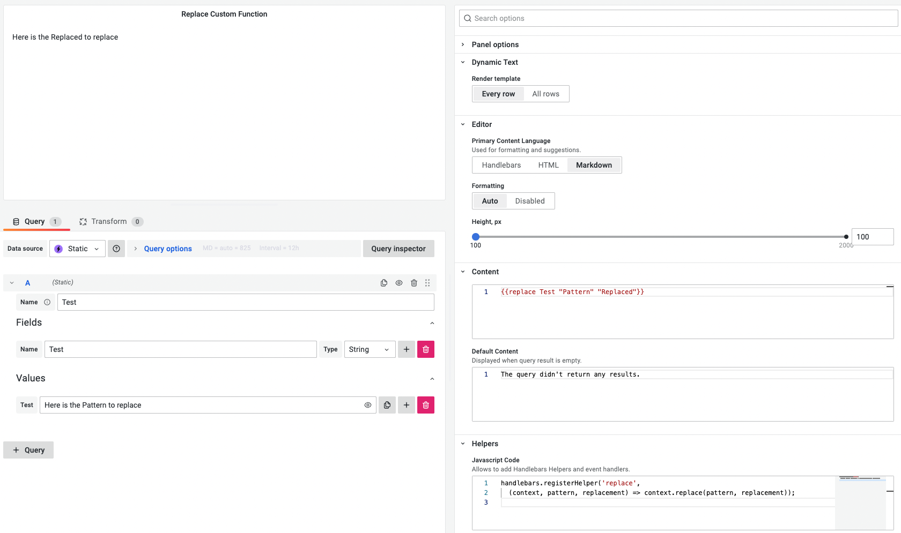

# JavaScript Code

:::info

Supported since Dynamic Text panel 2.2.0.

:::

JavaScript Code allows to add a Handlebars helpers and Event handlers.
 
## Parameters

| Parameter | Description |
| -- | -- |
| `data` | Data from data sources. Depends on the selected **Every Row** and **All Rows** option consists of one or many rows data.|
| `getLocale()` | Returns user's locale: 'en', 'fr', 'es', etc. |
| `handlebars` | Handlebars library. |

## Define Custom Handlebars helper

  A custom handlebars helper can be added to replace the field's value using a pattern.

```handlebars
{{replace Test "Pattern" "Replaced"}}
```

JavaScript Code:

```js
handlebars.registerHelper('replace',
  (context, pattern, replacement) => context.replace(pattern, replacement));
```



## Add Event Handler

  A custom event handler can be added to react to a button click.

```html
<button onclick="myFunc()">{{test}}</button>
```

JavaScript Code:

```js
myFunc = () => {
  alert('Bonjour!');
};
```

## Add Internationalization

Grafana 9 supports Internationalization, which is not fully exposed to plugins yet. Meanwhile, we can use `getLocale()` method to get a value for the selected locale and show phrases from a defined dictionary.

Content:

```handlebars
{{translate "Hello"}}
```

Default Content:

```handlebars
{{translate "Default"}}
```

JavaScript Code:

```js
const messages = {
  "Hello": {
    'en': 'Hello',
    'fr': 'Salut',
    'es': 'Hola'
  },
  "Default": {
    'en': "The query didn't return any results.",
    'fr': "La requête n'a renvoyé aucun résultat.",
    'es': "La consulta no arrojó ningún resultado."
  },
}

const locale = getLocale();

handlebars.registerHelper('translate',
  (message) => messages[message][locale] ?? messages[message]['en']);
```
