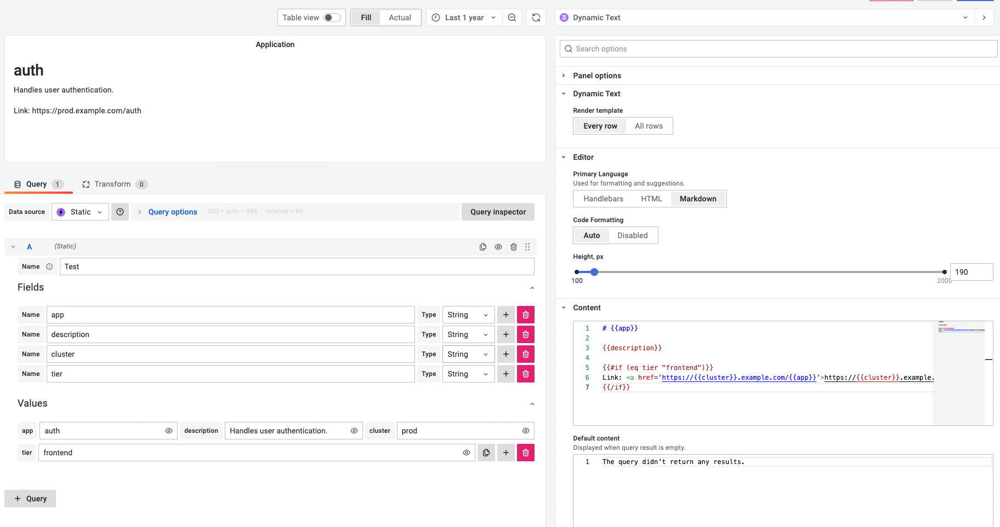

# Content

It is the code editor where you can place the parsing commands or, in other words, create a visualization template for your data. To reference the data elements in your template, use double and triple braces.

To display a value from the `app` field:

```handlebars
{{app}}
```

Depending on the `All rows/Every row` toggle, the template is applied to either every row or to the entire query results.

## Render HTML from data

If you would like to render HTML returned by the data source, you need to use three-brace expressions, `{{{htmlValue}}}`, otherwise Handlebars escape the HTML content.

```handlebars
<ul>
{{{htmlValue}}}
</ul>
```

where `htmlValue` is

```html
<li>foo</li>
<li>bar</li>
```

## Default content

The default content is displayed if the connected data source returns nothing. Use it to give users instructions on what to do or who to contact when the query returns an empty result.

Even though there are no data from the data source, you can still use the available [helpers](helpers).

## The rendering order

The panel renders Handlebars → Markdown → Sanitized HTML, unless disabled, and displays the final result.

## Every row and All rows

You can choose how the retrieved data is passed into the Dynamic Text Panel.
 - `Every row` means that the **content** template is applied to every retrieved row.
 - `All rows`, the query results are passed entirely as the `data` field to the template.
 
In order to work with the query results as a whole, you can use [builtin-helpers](https://handlebarsjs.com/guide/builtin-helpers.html#each) to iterate over the records.

## Example

If your data source returns the following four columns of data:

```md
| app  | description                  | cluster | tier     |
| ---- | ---------------------------- | ------- | -------- |
| auth | Handles user authentication. | prod    | frontend |
```

you can display it using the following template:

```handlebars
# {{app}}

{{description}}

{{#if (eq tier "frontend")}}
Link: <a href='https://{{cluster}}.example.com/{{app}}'>https://{{cluster}}.example.com/{{app}}</a>
{{/if}}
```



## Sanitizing

Sanitizing is enabled by default, which makes some elements like `<button>` unavailable in the **content** panel parameter.

To disable sanitizing, use the Grafana configuration option [`disable_sanitize_html`](https://grafana.com/docs/grafana/latest/setup-grafana/configure-grafana/#disable_sanitize_html). For Docker container and Docker Compose, use as:

```bash
- GF_PANELS_DISABLE_SANITIZE_HTML=true
```
