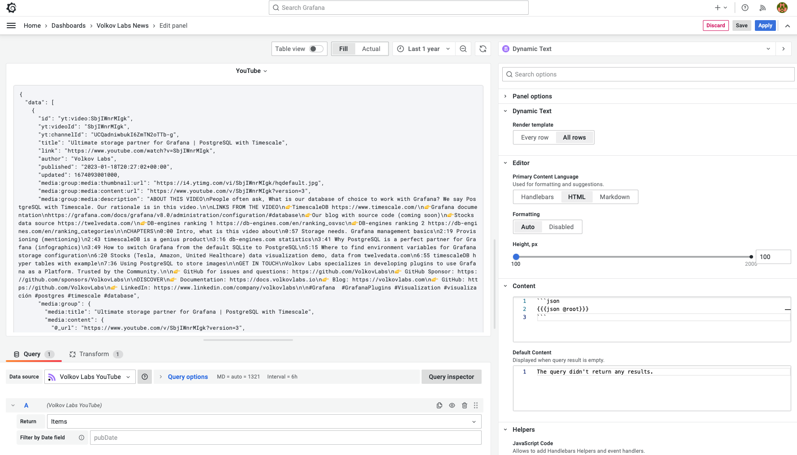
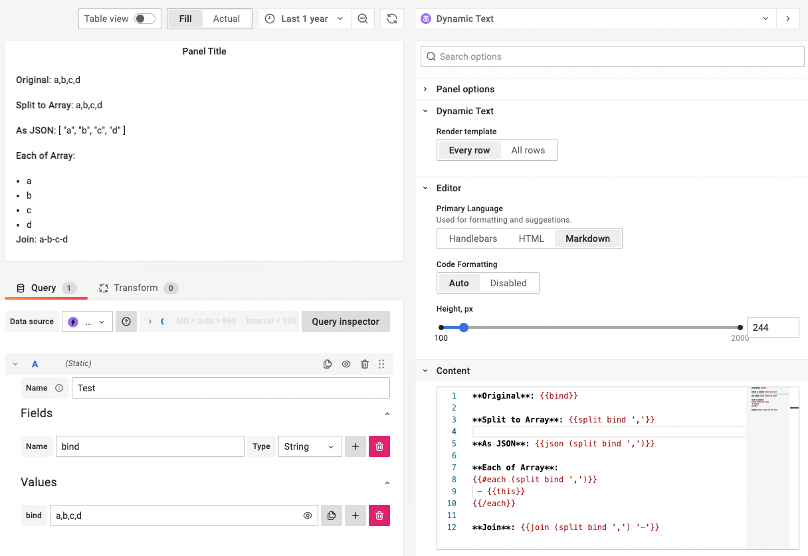

# Helpers

Helpers are functions that let you perform basic text transformation within your template.

## `{{contains}}`

Checks if given value exists within an array

```handlebars
<!-- array: ['a', 'b', 'c'] -->

{{#if (contains array "a")}}
  Success!
{{else}}
  Not Found!
{{/if}}

<!-- result: 'Success!'  -->
```

## `{{date}}`

Formats the timestamp in a given field using a date format. Uses [helper-date](https://github.com/helpers/helper-date).

The field value must be a Unix timestamp or any of the formats supported by [date.js](https://date.js.org/).

```handlebars
<!-- Time: 1598791377556 -->

{{date Time "YYYY-MM-DD"}}

<!-- result: '2020-08-30'  -->
```

## `{{eq}}`

Compares two strings for equality.

```handlebars
<!-- app: foo -->

{{#if (eq app "auth")}}
  This is the auth app.
{{else}}
  This is not an auth app.
{{/if}}

<!-- result: 'Success!'  -->
```

## `{{join}}`

Join all elements of array into a string using a given separator.

```handlebars
<!-- array: ['a', 'b', 'c'] -->

{{join array "-"}}

<!-- result: 'a-b-c'  -->
```

## `{{json}}`

:::info

Supported since Dynamic Text panel 3.2.0.

:::

Present object (JSON) or array as string.

```handlebars
<!-- object or array -->

{{json obj}}

<!-- result: as string  -->
```



## `{{split}}`

:::info

Supported since Dynamic Text panel 3.2.0.

:::

Split a string into array using a given separator.

```handlebars
<!-- string: 'a,b,c,d' -->

{{split str ","}}

<!-- result: ['a','b','c']  -->
```



## `{{toFixed}}`

Formats the given number using fixed-point notation.

```handlebars
<!-- Value: 1.1234 -->

{{toFixed Value 2}}

<!-- result: '1.12' -->
```

## `{{variable}}`

Returns a string array of the currently selected values for a certain [variable](https://grafana.com/docs/grafana/latest/dashboards/variables/).

```handlebars
{{variable "hostname"}}

<!-- result: ['server1', 'server2', 'server3']  -->
```

Check if variable `my_var` contains value "1":

```handlebars
{{#if (contains (variable "my_var") "1")}}
  Variable contains 1
{{else}}
  Variable does not contain 1
{{/if}}
```