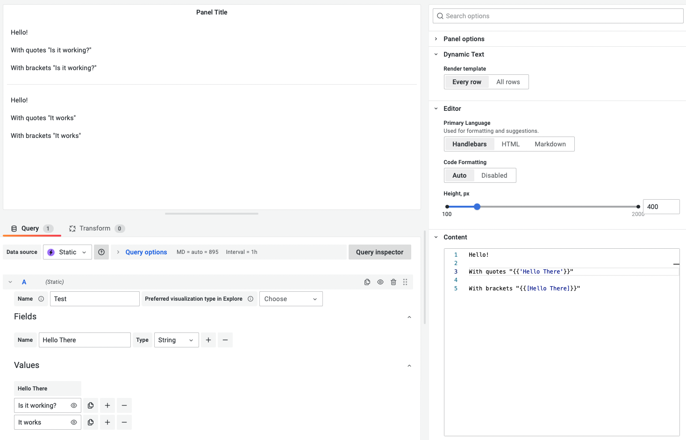

# Recipes

Useful snippets that you can use in your templates.

## Markdown list from variable

```handlebars
{{#each (variable "hostname")}}

- {{this}}

{{/each}}
```

## Conditional content

```handlebars
{{#if (eq app "auth")}}
  This is the auth app.
{{else}}
  This is not an auth app.
{{/if}}
```

## Dynamic templates using dashboard variables

Use the `lookup` helper function to create dynamic templates based on dashboard variables.

The following template creates a key-value pair from every selected value in the `myvar` dashboard variable.

```handlebars
book:
{{#each (variable "props")}}
  {{this}}: {{lookup @root this}}
{{/each}}
```

## Initial context

Display the Initial context with which the template was executed.

```handlebars
{{json @root}}
```

Take a look at the [Documentation](https://handlebarsjs.com/api-reference/data-variables.html#root) for Handlebar variables.

## Display a specific row in the data

To address a specific row in the returned data, select **All Rows** option:

```handlebars
{{data.4.title}}
```

or use Handlebars variables:

```handlebars
{{#each data}}
  {{#if (eq @index 3)}}
    {{title}}
  {{/if}}
{{/each}}
```

## Field name with spaces

Field names with spaces should be displayed as `{{[Field Name]}}` or `{{'Field Name'}}`

