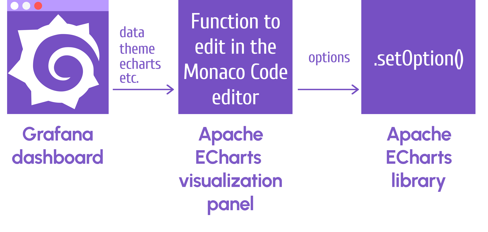
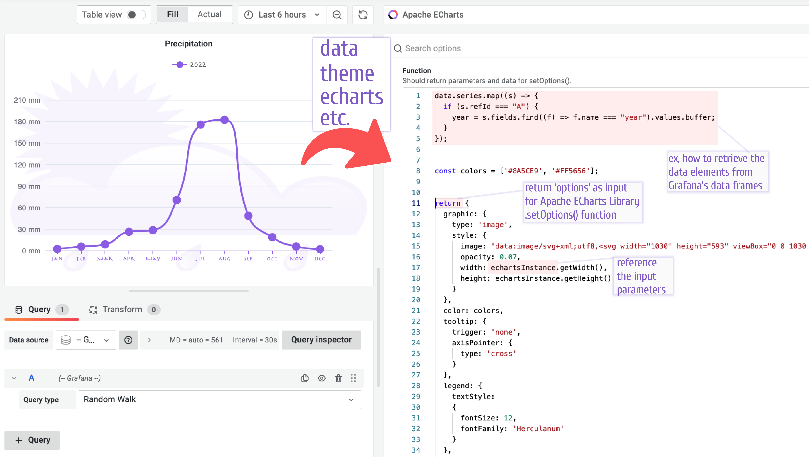
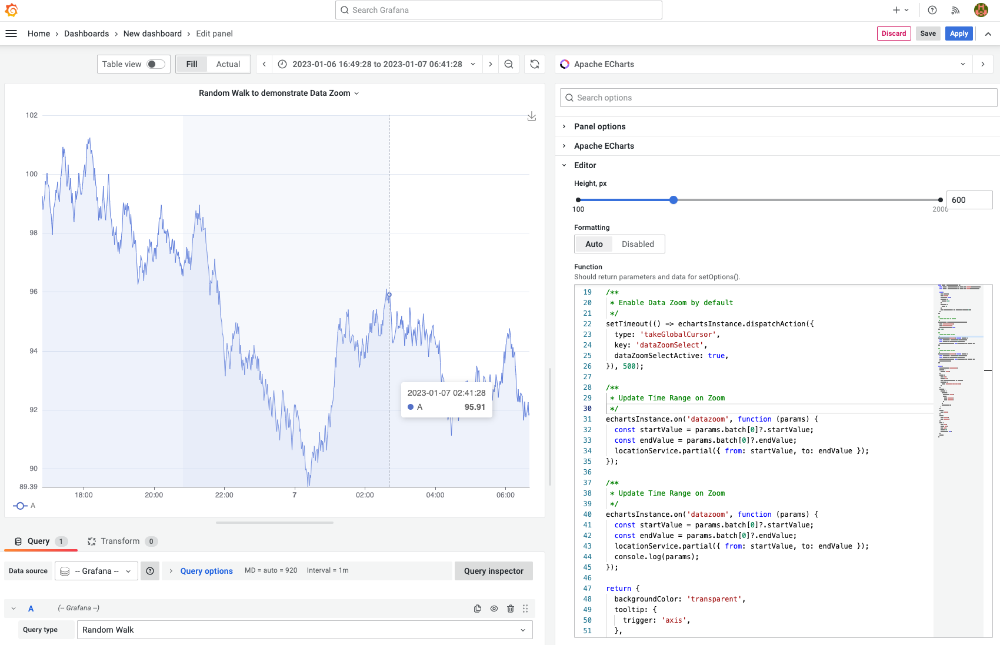

# setOption() function

`setOption(options)` is the main Apache ECharts library function. This function is called to build any chart. It has one mandatory parameter - `options` which is a chart configuration in a JSON format.



You specify the `options` in the Apache ECharts visualization panel in the Monaco Code editor located on the right-hand side. 



This whole text area is basically a body of the function that you write for the execution. This function takes in many parameters from Grafana. See the complete list in the table below.

The only parameter that is passed from this function to the `setOption()` is `options`. See the 'return' statement in the picture above.
 
## Parameters

| Parameter | Description |
| -- | -- |
| `data` | Grafana's `data` object with time range, series and request information. See the example on the picture above. |
| `echarts` | ECharts library. |
| `echartsInstance` | Instance of the ECharts. See the example on the picture above. To learn more about [echartsInstance](https://echarts.apache.org/en/api.html#echartsInstance) take a look at the official documentation.|
| `ecStat` | A statistical and data mining tool for Apache ECharts. More information in the [ecStat](tutorials/ecstat) section. |
| `locationService` | Grafana's `locationService` to work with browser location and history. |
| `notifyError(['Header', 'Error Message'])` | Display error notification. |
| `notifySuccess(['Header', 'Message'])` | Display successful notification. |
| `replaceVariables` | The `replaceVariables()` function to interpolate variables. |
| `theme` | Grafana's `theme` object. |


To learn more about parameters, you can log them in the Browser Console:

```javascript
console.log(data, theme, echartsInstance, echarts, replaceVariables, locationService);
```

## Event Handling

Users can trigger related events through their operation. To react on Mouse and other events, use `echartsInstance``:

```javascript
/**
 * On Mouse Click
 */
echartsInstance.on('click', (params) => {
  notifySuccess(['Event', 'On Click']);
  ...
  echartsInstance.resize(); // to redraw visualization
});

/**
 * On Double Click
 */
echartsInstance.on('dblclick', (params) => {
  ...
  echartsInstance.resize();
});
```

For more examples and details, take a look at the official documentation [Event and Action](https://apache.github.io/echarts-handbook/en/concepts/event/).

## Notifications

Success and Error notifications can be triggered on events handling:

```javascript
notifySuccess(['Update', 'Values updated successfully.']);
notifyError(['Update', `An error occured updating values.`]);
```

## Scale when resizing

To scale the content when panel is resized use `echartsInstance` methods to retrieve the width and height of the panel.

```javascript
  graphic: {
    type: "image",
    style: {
      image: `data:image/svg+xml;utf8,${SVG}`,
      width: echartsInstance.getWidth(),
      height: echartsInstance.getHeight(),
    },
  },
```

To learn more about [echartsInstance](https://echarts.apache.org/en/api.html#echartsInstance) take a look at the official documentation.

## Data Zoom to update Time Range

Data Zoom feature allows to select the time range on the chart. When time range selected the event can trigger updating dashboard's time range using `locationService` parameter similar to Grafana behaviour.



```javascript
const series = data.series.map((s) => {
  const sData = s.fields.find((f) => f.type === 'number').values.buffer;
  const sTime = s.fields.find((f) => f.type === 'time').values.buffer;

  return {
    name: s.refId,
    type: 'line',
    showSymbol: false,
    areaStyle: {
      opacity: 0.1,
    },
    lineStyle: {
      width: 1,
    },
    data: sData.map((d, i) => [sTime[i], d.toFixed(2)]),
  };
});

/**
 * Enable Data Zoom by default
 */
setTimeout(() => echartsInstance.dispatchAction({
  type: 'takeGlobalCursor',
  key: 'dataZoomSelect',
  dataZoomSelectActive: true,
}), 500);

/**
 * Update Time Range on Zoom
 */
echartsInstance.on('datazoom', function (params) {
  const startValue = params.batch[0]?.startValue;
  const endValue = params.batch[0]?.endValue;
  locationService.partial({ from: startValue, to: endValue });
});

return {
  backgroundColor: 'transparent',
  tooltip: {
    trigger: 'axis',
  },
  legend: {
    left: '0',
    bottom: '0',
    data: data.series.map((s) => s.refId),
    textStyle: {
      color: 'rgba(128, 128, 128, .9)',
    },
  },
  toolbox: {
    feature: {
      dataZoom: {
        yAxisIndex: 'none',
        icon: {
          zoom: 'path://',
          back: 'path://',
        },
      },
      saveAsImage: {},
    }
  },
  xAxis: {
    type: 'time',
  },
  yAxis: {
    type: 'value',
    min: 'dataMin',
  },
  grid: {
    left: '2%',
    right: '2%',
    top: '2%',
    bottom: 24,
    containLabel: true,
  },
  series,
};
```