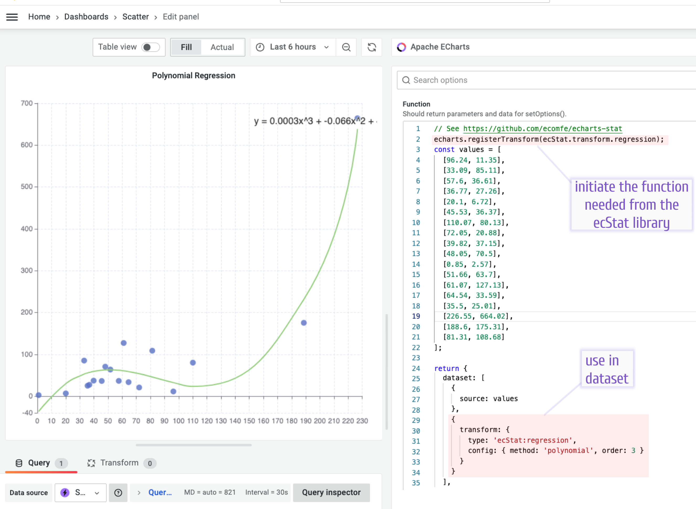

import Image from "@theme/Image";
import Video from "@theme/Video";

# Statistical and Data Mining

The `ecStat` is a separate library created to bring statistical and data mining abilities to the charting process in the Apache ECharts library.

:::info

The `ecStat` is supported by the Apache ECharts visualization panel starting from version 3.7.0.

:::

An example of using is on [echarts.volkovlabs.io](https://echarts.volkovlabs.io/d/U332C4K4z/scatter?orgId=1&editPanel=10). You can copy the code and use it as-is in your Grafana dashboard.

Watch the video for detailed tutorial on three data mining ecStat functions

- Regression
- Clustering
- Histograms.

In addition to the above ecStat also provides basic statistical tools like deviation, quantile, min, max, mean, and median.

<Video
  src="https://www.youtube.com/embed/qfDrAW8-Mh8"
  title="Histograms, Clustering. Regression in Apache ECharts panel for Grafana."
/>
